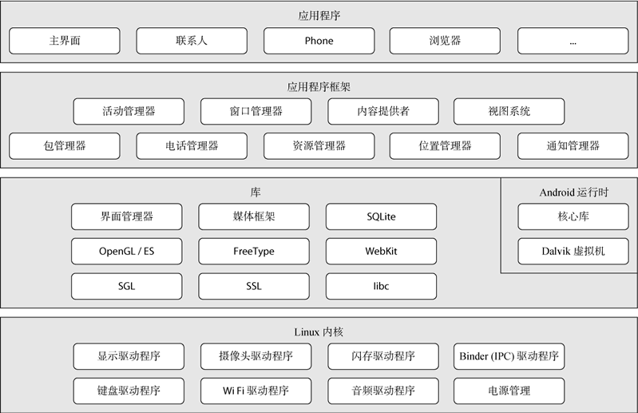

# 安卓系统架构图

Android 操作系统的系统架构总体分为 4 层，由上到下依次是：

- 应用程序层
- 应用框架层
- 核心类库
- Linux 内核

其中，核心类库中包含 `系统库` 及 `Android 运行时` 环境。

## 应用程序层

应用程序层包括我们所有安装的 App，如通讯录、浏览器、微信等。开发者编写的 Android 代码也会运行在该层中。

在 Android 项目开发阶段，项目代码处在应用程序层，需要调用应用框架层的服务来实现不同的功能。

## 应用框架层

应用框架层为开发者提供通用的、核心的高级服务。它相当于是一组抽象的核心公共 API，为应用程序之间、应用程序与系统之间的交互提供入口。

应用框架层的常见服务包括以下五种：

- 视图系统（View）：一个可扩展的视图集合，用于创建应用程序用户界面。
- 内容管理器（Content Provider）： 允许应用程序之间发布和分享数据。
- 资源管理器（Resource Manager）： 提供访问非代码资源，如本地字符串、图形等。
- 通知管理器（Notification Manager）：允许应用程序显示对话框或者通知给用户。
- 活动管理器（Activity Manager）：控制应用程序生命周期和活动栈的所有方面。

## 核心类库

核心类库提供了更底层的功能性类库，用于与 Linux 内核交互。应用框架层的服务会调用这些核心类库实现各自的功能。

### 1. 系统库

系统库主要是一些核心的 C/C++ 库，它们负责与 Linux 系统交互，调度系统提供的的设备能力。系统库一般不需要 Android 开发者关注，但是要了解，比如版本与兼容性之类的。

### 2. Android 运行时

Android 运行时提供名为 `Dalvik 虚拟机` 的关键组件，类似于 Java 虚拟机，但专门为 Android 设计和优化。

Dalvik 虚拟机使得可以在 Java 中使用 Linux 核心功能，如内存管理和多线程。Dalvik 虚拟机使得每一个 Android 应用程序运行在自己独立的虚拟机进程。

# Linux 内核

Linux 内核也作为硬件和软件之间的抽象层，提供了进程管理、内存管理、设备管理（如摄像头，键盘，显示器）、网络等功能。
