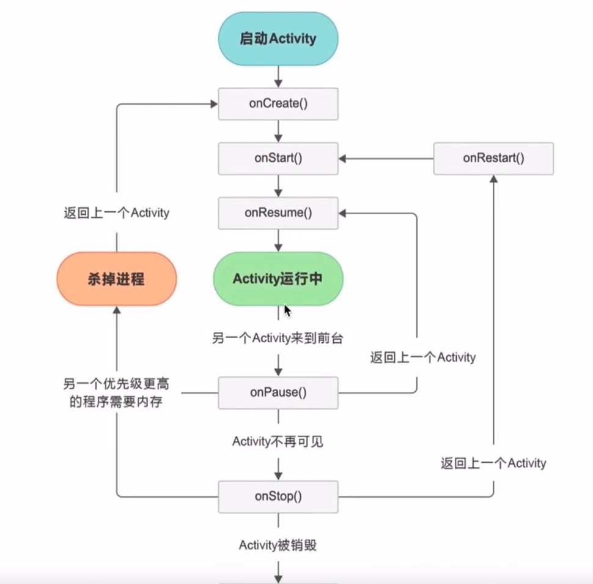

# Kotlin 介绍

Kotlin 是一种在 Java 虚拟机上运行的静态类型编程语言，被称之为 Android 世界的 Swift，由 JetBrains 设计开发并开源。

Kotlin 可以编译成 Java 字节码，也可以编译成 JavaScript，方便在没有 JVM 的设备上运行。

## 优势

- 简洁: 大大减少样板代码的数量。
- 安全: 避免空指针异常等整个类的错误。
- 互操作性: 充分利用 JVM、Android 和浏览器的现有库。
- 工具友好: 可用任何 Java IDE 或者使用命令行构建。

