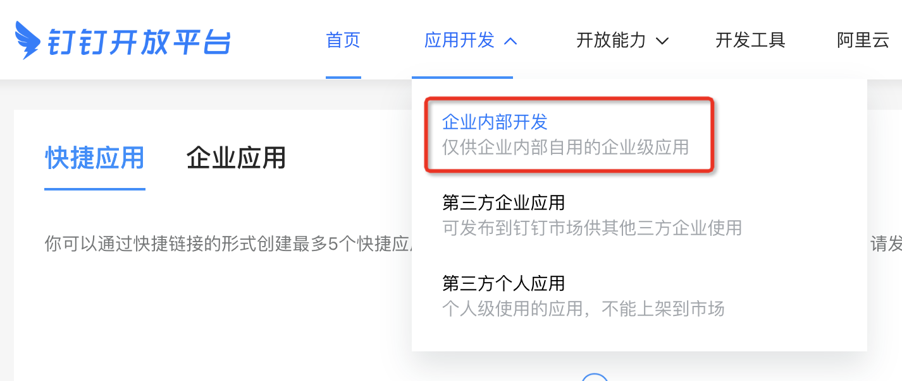
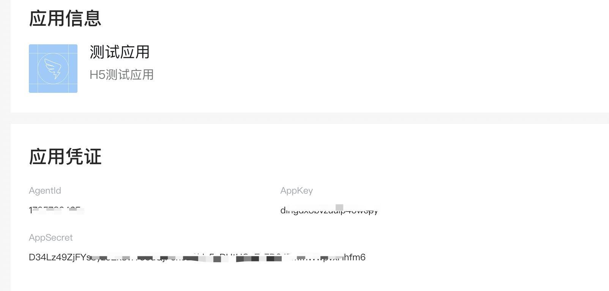
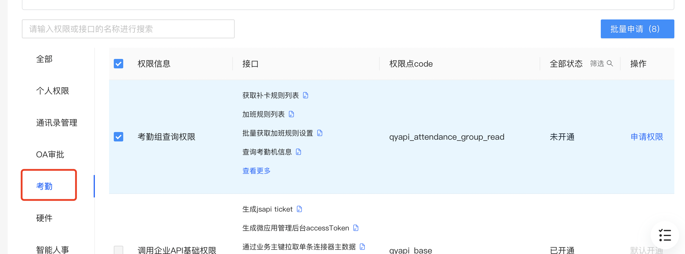
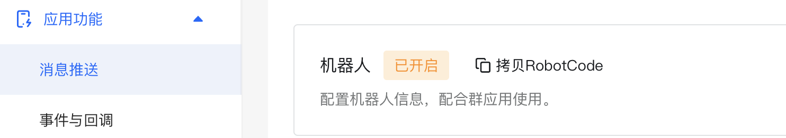

# 组员老是忘记打卡，我开发了一款小工具，让全组三个月全勤！

大家好，我是杨成功。

我司使用钉钉考勤打卡，人事要求的比较严格，两次未打卡记缺勤一天。但我们组醉心于工作，老是上下班忘记打卡，每月的工资被扣到肉疼。

开始的时候我们都设置了一个打卡闹铃，下班后准时提醒，但有的时候加班，加完班回家又忘记打卡了。还有的时候迷之自信的以为自己打卡了，第二天看考勤记录发现没打卡。

为了彻底解决这个问题，守住我们的钱袋子，我开发了一款打卡提醒工具，让全组连续三个月全勤！

下面介绍一下，这个小工具是如何实现的。

## 小工具实现思路

首先思考一下：闹铃提醒为什么不能百分之百有用？

1. 机械的提醒

闹铃提醒很机械，每天一个点固定提醒，时间久了人就会免疫。就像起床闹铃用久了，慢慢的那个声音对你不起作用了，此时不得不换个铃声才行。

2. 不能重复提醒

闹铃只会在固定时间提醒一次，没有办法判断是否打卡，更不会智能地发现你没有打卡，再提醒一次。

既然闹铃做不到，那我们就用程序来实现吧。按照上述两个原因，我们要实现的提醒工具必须包含两个功能：

- 1. 检测用户是否打卡，未打卡则提醒，已打卡不提醒。
- 2. 对未打卡用户循环检测，重复提醒，直到打卡为止。

如果能实现这两个功能，那么忘记打卡的问题多半也就解决了。

打卡数据需要从钉钉获取，并且钉钉有推送功能。因此我们的方案是：利用 Node.js + 钉钉 API 来实现打卡状态检测和精准的提醒推送。

## 认识钉钉 API

钉钉是企业版的即时通讯软件。与微信最大的区别是，它提供了开放能力，可以用 API 来实现创建群组，发送消息等可定制的通讯能力。

我们用到的钉钉 API 主要有以下几个：

- 获取凭证
- 获取用户 ID
- 检查打卡状态
- 群内消息推送
- @某人推送

在使用钉钉 API 之前，首先要确认有公司级别的钉钉账号（使用过钉钉打卡功能一般就有公司账号），后面的步骤都是在这个账号下实现。

### 申请开放平台应用

钉钉开发第一步，先去钉钉开放平台申请一个应用，拿到 appKey 和 appSecret。

> 钉钉开放平台地址：https://open.dingtalk.com/developer

进入平台后，点击“开发者后台”，如下图：


开发者后台就是管理自己开发的钉钉应用的地方，进入后选择【应用开发 -> 企业内部开发】，如下图：



进入这个页面可能提示暂无权限，这是因为开发企业钉钉应用需要开发者权限，这个权限需要管理员在后台添加。

> 管理员加开发者权限方式：  
> 进入 [OA 管理后台](https://oa.dingtalk.com/)，选择设置-权限管理-管理组-添加开发者权限下的对应权限。

进入之后，选择【创建应用 -> H5 微应用】，根据提示创建应用。创建之后在【应用信息】中可以看到两个关键字段：

- AppKey
- AppSecret



这两个字段非常重要，获取接口调用凭证时需要将它们作为参数传递。AppKey 是企业内部应用的唯一身份标识，AppSecret 是对应的调用密钥。

### 搭建服务端应用

钉钉 API 需要在服务端调用，也就是说，我们需要搭建一个服务端应用来请求钉钉 API，然后在这个服务端应用中执行自己的业务逻辑。

切记不可以在客户端直接调用钉钉 API，因为 AppKey 和 AppSecret 都是保密的，绝不可以直接暴露在客户端。

我们使用 Node.js 的 Express 框架来搭建一个简单的服务端应用，在这个应用上与钉钉 API 交互。搭建好的 Express 目录结构如下：

```js
|-- app.js // 入口文件
|-- catch // 缓存目录
|-- router // 路由目录
|   |-- ding.js // 钉钉路由
|-- utils // 工具目录
|   |-- token.js // token相关
```

app.js 是入口文件，也是应用核心逻辑，代码简单书写如下：

```js
const express = require('express');
const app = express();
const bodyParser = require('body-parser');
const cors = require('cors');

app.use(bodyParser.json());
app.use(cors());

// 路由配置
app.use('/ding', require('./router/ding'));

// 捕获404
app.use((req, res, next) => {
  res.status(404).send('Not Found');
});

// 捕获异常
app.use((err, req, res, next) => {
  console.error(err);
  res.status(err.status || 500).send(err.inner || err.stack);
});

app.listen(8080, () => {
  console.log(`listen to http://localhost:8080`);
});
```

另一个 router/ding.js 文件是 Express 标准的路由文件，在这里编写钉钉 API 的相关逻辑，代码基础结构如下：

```js
// router/ding.js
var express = require('express');
var router = express.Router();

router.get('/', (req, res, next) => {
  res.send('钉钉API');
});

module.exports = router;
```

现在将应用运行起来：

```sh
$ node app.js
```

然后访问 http://localhost:8080/ding，浏览器页面显示出 “钉钉 API” 几个字，表示运行成功。

## 对接钉钉应用

一个简单的服务端应用搭建好之后，就可以准备接入钉钉 API 了。

接入步骤参考开发文档，文档地址在[这里](https://open.dingtalk.com/document/org/application-types)。

### 1. 获取 API 调用凭证

钉钉 API 需要验证权限才可以调用。验证权限的方式是，根据上一步拿到的 AppKey 和 AppSecret 获取一个 access_token，这个 access_token 就是钉钉 API 的调用凭证。

后续在调用其他 API 时，只要携带 access_token 即可验证权限。

钉钉 API 分为新版和旧版两个版本，为了兼容性我们使用旧版。旧版 API 的 URL 根路径是【https://oapi.dingtalk.com】，下文称之为 baseURL。

根据文档，获取 access_token 的接口是 ${baseURL}/gettoken。在 utils/token.js 文件中定义一个获取 token 的方法，使用 GET 请求获取 access_token，代码如下：

```js
const fetchToken = async () => {
  try {
    let params = {
      appkey: 'xxx',
      appsecret: 'xxx',
    };
    let url = `${baseURL}/gettoken`;
    let result = await axios.get(url, { params });
    if (result.data.errcode != 0) {
      throw result.data;
    } else {
      return result.data;
    }
  } catch (error) {
    console.log(error);
  }
};
```

上述代码写好之后，就可以调用 fetchToken 函数获取 access_token 了。

获取到 access_token 之后需要持久化的存储起来供后续使用。在浏览器端，我们可以保存在 localStorage 中，而在 Node.js 端，最简单的方法是直接保存在文件中。

写一个将 access_token 保存为文件，并且可读取的类，代码如下：

```js
var fs = require('fs');
var path = require('path');

var catch_dir = path.resolve(__dirname, '../', 'catch');

class DingToken {
  get() {
    let res = fs.readFileSync(`${catch_dir}/ding_token.json`);
    return res.toString() || null;
  }
  set(token) {
    fs.writeFileSync(`${catch_dir}/ding_token.json`, token);
  }
}
```

写好之后，现在我们获取 access_token 并存储：

```js
var res = await fetchToken();
if (res) {
  new DingToken().set(res.access_token);
}
```

在下面的接口调用时，就可以通过 `new DingToken().get()` 来获取到 access_token 了。

### 2. 查找组员 ID

有了 access_token 之后，第一个调用的钉钉 API 是获取员工的 userid。userid 是员工在钉钉中的唯一标识。

有了 userid 之后，我们才可以获取组员对应的打卡状态。最简单的方法是通过手机号获取员工的 userid，手机号可以直接在钉钉上查到。

> 根据手机号查询用户文档在[这里](https://open.dingtalk.com/document/orgapp-server/query-users-by-phone-number)。

接口调用代码如下：

```js
let access_token = new DingToken().get();
let params = {
  access_token,
};
axios
  .post(
    `${baseURL}/topapi/v2/user/getbymobile`,
    {
      mobile: 'xxx', // 用户手机号
    },
    { params },
  )
  .then((res) => {
    console.log(res);
  });
```

通过上面请求方法，逐个获取所有组员的 userid 并保存下来，我们在下一步使用。

### 3. 获取打卡状态

拿到组员的 userid 列表，我们就可以获取所有组员的打卡状态了。

钉钉获取打卡状态，需要在 H5 应用中申请权限。打开前面创建的应用，点击【权限管理 -> 考勤】，批量添加所有权限：



接着进入【开发管理】，配置一下服务器出口 IP。这个 IP 指的是我们调用钉钉 API 的服务器 IP 地址，开发的时候可以填为 127.0.0.1，部署后更换为真实的 IP 地址。

做好这些准备工作，我们就可以获取打卡状态了。获取打卡状态的 API 如下：

> API 地址：${baseURL}/attendance/list  
> 请求方法：POST

这个 API 的请求体是一个对象，对象必须包含的属性如下：

- workDateFrom：查询考勤打卡记录的起始工作日。
- workDateTo：查询考勤打卡记录的结束工作日。
- userIdList：查询用户的用户 ID 列表。
- offset：数据起始点，用于分页，传 0 即可。
- limit：获取考勤条数，最大 50 条。

这里的字段解释一下。workDateFrom 和 workDateTo 表示查询考勤的时间范围，因为我们只需要查询当天的数据，因此事件范围就是当天的 0 点到 24 点。

userIdList 就是我们上一步取到的所有组员的 userid 列表。

将获取打卡状态写为一个单独的方法，代码如下：

```js
const dayjs = require('dayjs');
const access_token = new DingToken().get();

// 获取打卡状态
const getAttendStatus = () => {
  let params = {
    access_token,
  };
  let body = {
    workDateFrom: dayjs().startOf('day').format('YYYY-MM-DD HH:mm:ss'),
    workDateTo: dayjs().endOf('day').format('YYYY-MM-DD HH:mm:ss'),
    userIdList: ['xxx'], // userid 列表
    offset: 0,
    limit: 40,
  };
  return axios.post(`${baseURL}/attendance/list`, body, { params });
};
```

查询考勤状态的返回结果是一个列表，列表项的关键字段如下：

- userId：打卡人的用户 ID。
- userCheckTime：用户实际打卡时间。
- timeResult：用户打卡结果。Normal：正常，NotSigned：未打卡。
- checkType：考勤类型。OnDuty：上班，OffDuty：下班。

其他更多字段的含义请参考[文档](https://open.dingtalk.com/document/orgapp-server/open-attendance-clock-in-data)

上面的 4 个字段可以轻松判断出谁应该打卡，打卡是否正常，这样我们就能筛选出没有打卡的用户，对这些未打卡的用户精准提醒。

筛选打卡状态分为两种情况：

- 上班打卡
- 下班打卡

上下班打卡要筛选不同的返回数据。假设获取的打卡数据存储在变量 attendList 中，获取方式如下：

```js
// 获取上班未打卡用户
const getOnUids = () =>
  attendList
    .filter((row) => row.checkType == 'OnDuty' && row.timeResult == 'NotSigned')
    .map((row) => row.userId);

// 下班未打卡用户
const getOffUids = () =>
  attendList
    .filter((row) => row.checkType == 'OffDut' && row.timeResult == 'NotSigned')
    .map((row) => row.userId);
```

找到未打卡的用户，接下来就是通知提醒了。

### 4. 发送提醒通知

在钉钉中最常用的消息推送方式是：在群聊中添加一个机器人，向这个机器人的 webhook 地址发送消息，即可实现自定义推送。

还是进入前面创建的 H5 应用，在菜单中找到【应用功能 -> 消息推送 -> 机器人】，根据提示配置好机器人。



创建好机器人后，打开组员所在的钉钉群（已有群或新建群都可）。点击【群设置 -> 智能群助手 -> 添加机器人】，选择刚才创建的机器人，就可以将机器人绑定在群里了。


绑定机器人后，点击机器人设置，会看到一个 Webhook 地址，请求这个地址即可向群聊发送消息。对应的 API 如下：

> API 地址：${baseURL}/robot/send?access_token=xxx  
> 请求方法：POST

现在发送一条“我是打卡机器人”，实现代码如下：

```js
const sendNotify = (msg, atuids = []) => {
  let access_token = 'xxx'; // Webhook 地址上的 access_token
  // 消息模版配置
  let infos = {
    msgtype: 'text',
    text: {
      content: msg,
    },
    at: {
      atUserIds: atuids,
    },
  };
  // API 发送消息
  axios.post(`${baseURL}/robot/send`, infos, {
    params: { access_token },
  });
};
sendNotify('我是打卡机器人');
```

解释一下：代码中的 `atUserIds` 属性表示要 @ 的用户，它的值是一个 userid 数组，可以 @ 群里的某几个成员，这样消息推送就会更精准。

发送之后会在钉钉群收到消息，效果如下：


## 综合代码实现

前面几步创建了钉钉应用，获取了打卡状态，并用机器人发送了群通知。现在将这些功能结合起来，写一个检查考勤状态，并对未打卡用户发送提醒的接口。

在路由文件 router/ding.js 中创建一个路由方法实现这个功能：

```js
var dayjs = require('dayjs');

router.post('/attend-send', async (req, res, next) => {
  try {
    // 需要检测打卡的 userid 数组
    let alluids = ['xxx', 'xxxx'];
    // 获取打卡状态
    let attendList = await getAttendStatus(alluids);
    // 是否9点前（上班时间）
    let isOnDuty = dayjs().isBefore(dayjs().hour(9).minute(0));
    // 是否18点后（下班时间）
    let isOffDuty = dayjs().isAfter(dayjs().hour(18).minute(0));
    if (isOnDuty) {
      let uids = getOnUids();
      if (alluids.length > uids.length) {
        // 未打卡用户
        let txuids = alluids.filter((r) => !uids.includes(r));
        sendNotify('上班没打卡，小心扣钱！', txuids);
      }
    } else if (isOffDuty) {
      let uids = getOffUids();
      if (alluids.length > uids.length) {
        // 未打卡用户
        let txuids = alluids.filter((r) => !uids.includes(r));
        sendNotify('下班没打卡，小心扣钱！', txuids);
      }
    } else {
      return res.send('不在打卡时间');
    }
    res.send('没有未打卡的同学');
  } catch (error) {
    res.status(error.status || 500).send(error);
  }
});
```

上述接口写好之后，我们只需要调用一下这个接口，就能实现自动检测上班或下班的打卡情况。如果有未打卡的组员，那么机器人会在群里发通知提醒，并且 @ 未打卡的组员。

```sh
# 调用接口
$ curl -X POST http://localhost:8080/ding/attend-send
```

检查打卡状态并提醒的功能实现了，现在还差一个”循环提醒“功能。

循环提醒的实现思路是，在某个时间段内，每隔几分钟调用一次接口。如果检测到未打卡的状态，就会循环提醒。

假设上下班时间分别是上午 9 点和下午 18 点，那么检测的时间段可以划分为：

- 1. 上班：8:30-9:00 之间，每 5 分钟检测一次；
- 2. 下班：18:20-19:20 之间，每 10 分钟检测一次；

上班打卡相对比较紧急，所以时间检测短，频率高。下班打卡相对比较宽松，下班时间也不固定，因此检测时间长，频率低一些。

确定好检测规则之后，我们使用 Linux 的定时任务 `crontab` 来实现上述功能。

首先将上面写好的 Node.js 代码部署到 Linux 服务器，部署后可在 Linux 内部调用接口。

### crontab 配置解析

简单说一下 crontab 定时任务如何配置。它的配置方式是一行一个任务，每行的配置字段如下：

```js
// 分别表示：分钟、小时、天、月、周、要执行的命令
minute hour day month weekday cmd
```

每个字段用具体的数字表示，如果要全部匹配，则用 \* 表示。上班打卡检测的配置如下：

```js
29-59/5 8 * * 1-5 curl -X POST http://localhost:8080/ding/attend-send
```

上面的 `29-59/5 8` 表示在 8:29 到 8:59 之间，每 5 分钟执行一次；1-5 表示周一到周五，这样就配置好了。

同样的道理，下班打卡检测的配置如下：

```js
20/10 18-19 * * 1-5 curl -X POST http://localhost:8080/ding/attend-send
```

在 Linux 中执行 `crontab -e` 打开编辑页面，写入上面的两个配置并保存，然后查看是否生效：

```sh
$ crontab -l
29-59/5 8 * * 1-5 curl -X POST http://localhost:8080/ding/attend-send
20/10 18-19 * * 1-5 curl -X POST http://localhost:8080/ding/attend-send
```

看到上述输出，表示定时任务创建成功。

现在每天上班前和下班后，小工具会自动检测组员的打卡状态并循环提醒。最终效果如下：

image.png

## 总结

这个小工具是基于钉钉 API + Node.js 实现，思路比较有意思，解决了实际问题。并且这个小项目非常适合学习 Node.js，代码精简干净，易于理解和阅读。

小项目已经开源，开源地址为：

https://github.com/ruidoc/attend-robot

欢迎大家 start，感谢。
