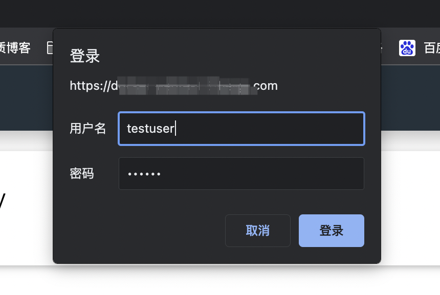
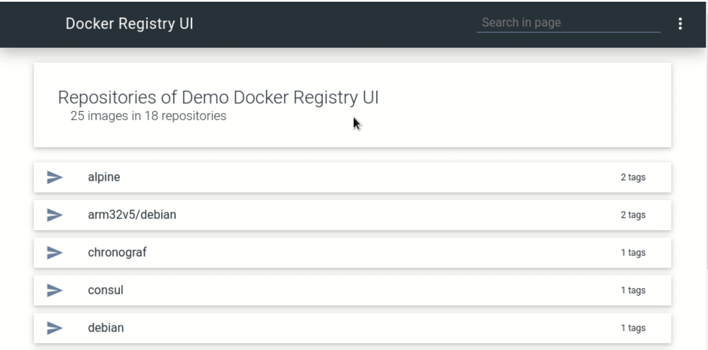

# 用 Docker 部署前端？先搭一个稳定的私有仓库再说

大家好，我是杨成功。

越来越多的前端团队选择用 Docker 部署前端项目，方法是将项目打包成一个镜像，然后在服务端直接拉镜像启动项目。这种方式可以忽略服务器环境差异，更容易做版本管理。

但我们平常使用 Docker 拉取镜像时，默认会从 `Docker Hub` 这个公共仓库拉取。虽然 Docker Hub 也可以上传自己的镜像，但是上传后会对所有人开放，这对公司项目来说显然是不允许的。

为此，Docker 官方提供了工具 `registry` 来帮助我们搭建私有镜像仓库，用于管理自己的镜像。后续所有的项目更新、升级、回滚，都要用到这个镜像仓库。

下面详细介绍如何使用`registry` 搭建私有镜像仓库。

### 创建镜像仓库

首先确保在你要搭建私有仓库的服务器上，已经安装好了 Docker（如何安装 Docker 这里不介绍）。

（1）使用命令拉取 `registry` 镜像：

```sh
$ docker pull registry
```

（2）建立要存储私有镜像的目录，如 `/data/docker/registry`：

```sh
$ mkdir -vp /data/docker/registry
```

（3）使用以下命令，基于 registry 镜像运将容器运行起来：

```sh
$ docker run -d \
  -p 5000:5000 \
  --restart=always \
  --name registry \
  -v /data/docker/registry:/var/lib/registry \
  registry
```

容器运行后会占用 `5000` 端口，该端口是访问镜像仓库的入口。

（4）运行成功后，使用以下命令测试连接情况：

```sh
$ curl http://localhost:5000/v2/_catalog
```

如果返回以下结果：

```sh
{"repositories":[]}
```

则表示镜像仓库创建成功。此时仓库内没有镜像，所以是一个空数组。

（5）配置 Nginx 转发

一般情况下，需要配置一个域名来转发 `5000` 端口。假设域名为 `docker.test.com`，添加一个配置文件，代码如下：

```
server {
  listen 80;
  server_name docker.test.com;
  charset utf-8;

  location / {
    proxy_pass http://127.0.0.1:5000;
    proxy_set_header Host $host:$server_port;
    proxy_set_header X-Forwarded-For $remote_addr;
    proxy_set_header X-Forwarded-Proto $scheme;
  }
}
```

配置后，使用 `nginx -s reload` 命令重载配置文件，即可通过该域名访问镜像仓库。

### 添加登录授权验证

上一节我们创建了私有仓库，允许客户端将自定义镜像上传到这里。不过，私有仓库不允许公开上传、更不允许公开下载，所以还要做授权验证。

和用户登录的逻辑一样，我们需要为私有仓库创建账号和密码，登录之后的客户端才能推送镜像。我们使用文件的方式存储账号密码，使用 `httpd:2` 这个镜像来创建账号密码。

（1）在数据目录（/data/docker/registry）下新建 auth 文件夹：

```sh
$ cd /data/docker/registry && mkdir auth
```

（2）添加用户 `testuser`、密码 `testpass`，命令如下：

```sh
$ docker run \
  --entrypoint htpasswd \
  httpd:2 -Bbn testuser testpass > auth/htpasswd
```

此时会创建一个 htpasswd 文件，该文件中存储了已添加的用户账号和密码。

（3）停止之前运行的容器，然后重新运行：

```sh
$ docker stop registry
$ docker run -d \
  -p 5000:5000 \
  --restart=always \
  --name registry \
  -v /data/docker/registry:/var/lib/registry \
  -v /data/docker/registry/auth:/auth \
  -e "REGISTRY_AUTH=htpasswd" \
  -e "REGISTRY_AUTH_HTPASSWD_REALM=Registry Realm" \
  -e REGISTRY_AUTH_HTPASSWD_PATH=/auth/htpasswd \
  registry:2
```

运行成功后，假设仓库域名是 docker.test.com，那么在浏览器中访问 `http://docker.test.com/v2/_catalog`，如果弹出登录框，让你输入账号密码，表示授权验证已生效。



### 添加 Web UI 管理镜像仓库

上一步通过域名访问仓库，登录后只能看到列出的镜像名字。然而我们需要管理镜像，比如查看版本、查看链接、删除无用镜像等，此时就需要一个 Web UI 界面来管理镜像仓库。

使用开源项目 `docker-registry-ui` 可以快速为镜像仓库搭建 Web UI。我们选择最简单的静态部署方式，使用 `docker-compose` 将 docker-registry-ui 与 registry 关联在一起。官方 demo 可以查看 [这里](https://github.com/Joxit/docker-registry-ui/tree/main/examples/ui-as-proxy)。

参考 demo 中的 simple.yml，我们写一个 `registry.yml`，作为 docker-compose 的配置：

```yml
version: '2.0'
services:
  registry:
    image: registry:2
    environment:
      - REGISTRY_AUTH=htpasswd
      - REGISTRY_AUTH_HTPASSWD_REALM=Registry Realm
      - REGISTRY_AUTH_HTPASSWD_PATH=/auth/htpasswd
    volumes:
      - /data/docker/registry:/var/lib/registry
      - /data/docker/registry/auth:/auth
    networks:
      - registry-ui-net

  ui:
    image: joxit/docker-registry-ui:latest
    ports:
      - 5000:80
    environment:
      - REGISTRY_TITLE=My Private Docker Registry
      - NGINX_PROXY_PASS_URL=http://registry:5000
      - SINGLE_REGISTRY=true
    depends_on:
      - registry
    networks:
      - registry-ui-net
networks:
  registry-ui-net:
```

这个配置将 registry 和 ui 两个服务绑成了一个应用容器，我们可以同时启动和停止它们。执行启动命令：

```sh
$ docker-compose -f registry.yml -d
```

启动后，访问 5000 端口即可 web 界面，同时 5000 也代理了 registry。也就是说。可以同时使用 5000 端口访问 web 界面和推送/拉取镜像。



### 设置允许删除镜像

默认 registry 的镜像是不允许删除的，registry-ui 也没有提供删除的按钮。

Registry 的配置是一个 YAML 文件，它提供了非常多的默认配置（文档参考[这里](https://docs.docker.com/registry/configuration/)），是否允许删除就是一个配置，默认如下：

```yml
storage:
  delete:
    enabled: false
```

因为我们是用 docker-compose 运行的，没有 registry 配置文件，只有 `registry.yml` 文件，所以允许删除的配置要在 registry.yml 里定义。

registry 提供了一个配置规则，可以将配置字段大写并且用`_`连接起来，组成一个环境变量，使配置生效。

所以允许删除的配置转换成环境变量是：

```sh
REGISTRY_STORAGE_DELETE_ENABLED=true
```

将该环境变量写入 registry.yml 文件中即完成了配置。如下：

```yml
services:
  registry:
    environment:
      - REGISTRY_STORAGE_DELETE_ENABLED=true
```

修改配置文件后重新启动容器，就可以在页面中看到删除按钮了。

最后，不管在电脑本地还是在 CI 工具中，上传镜像到该仓库时都需要登录。使用上门创建的用户名密码登录仓库，命令如下：

```sh
$ docker login -u testuser docker.test.com
```

其中 `testuser` 是用户名，`docker.test.com` 是镜像仓库域名，执行后输入密码即可登录成功。之后便可以向该仓库中上传镜像了。
