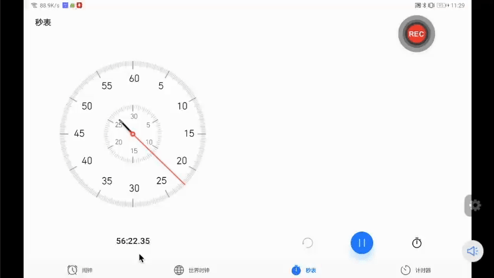
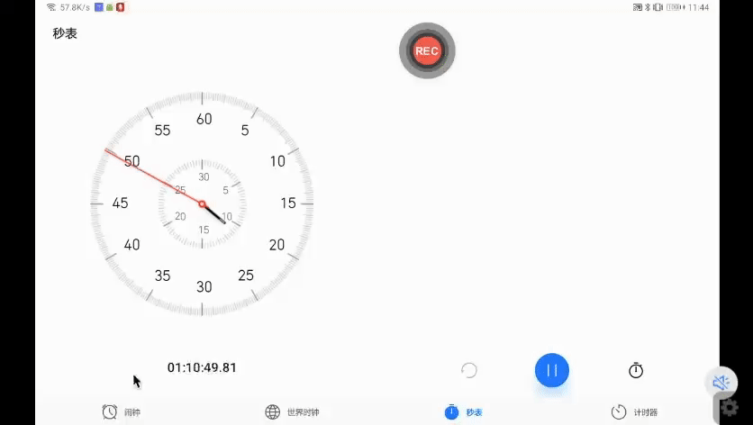
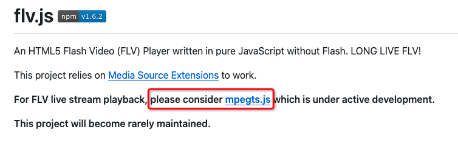
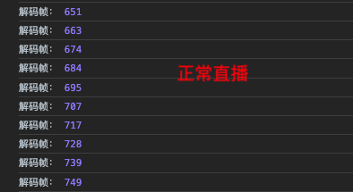
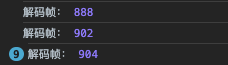

# flv.js 直播超简单，延迟和卡顿把我整疯了

大家好，我是杨成功。

之前写过一篇浏览器直播的文章，叫《用一个 flv.js 播放监控的例子，带你深撅直播流技术》。这片文章的热度还不错，主要内容就是科普直播是什么，以及如何在浏览器中播放直播。

实现方法很简单，使用一个流行的第三方包 `flv.js`，即可快速播放直播。

在我们的项目中也使用这种方式，比如播放海康监控器的直播、教学直播等都可以正常播放。然而在产品成熟后，我们发现直播中有两个致命问题：

- 1. 直播延迟，播越久延迟越高。
- 2. 直播卡顿，无法判断什么时候卡顿。

解决上述两个问题是直播稳定性和可用性的关键，下面就来详解一下。

## 抗延迟关键 ——— “追帧”

使用 flv.js 直播，需要一个 `<video>` 标签承载直播画面。默认情况下 video 标签用于播放点播（录制好的）视频，因此它会一边播放一边下载。

点播不要求实时性，暂停之后再继续播放，视频会接着暂停的画面继续播放；而如果是直播，暂停后继续播放时必须切换到最新的画面帧，这就是 “追帧” 的概念。

一图胜千言，不追帧的效果是这样的：



追帧的效果是这样的：



可以看到，设置追帧后的暂停重播，会立即切换到最新的画面。

在实际场景中，直播没有暂停按钮，但是常常会因为网络问题卡顿。如果卡顿恢复后视频没有追帧，就会导致直播延迟越来越高。

### 使用 mpegts.js 替代 flv.js

据传说，flv.js 的作者是一个高中毕业在 B 站上班的小伙子，月薪仅仅不到 5k。后来小伙离职去了日本，无法更新 flv.js，于是有了 mpegts.js。

目前 flv.js 已停止维护，mpegts.js 是其升级版，开发者是同一个人。涉及到追帧的高级功能，mpegts.js 支持的更好。在 flv.js 主页也可以看到推荐：



mpegts.js 的用法与 flv.js 基本一致，如下：

```js
import mpegts from 'mpegts.js';

let config = {};
let player = mpegts.createPlayer(
  {
    type: 'flv',
    isLive: true,
    url: 'http://xxxx.flv',
  },
  config,
);
```

mpegts.js 提供了自动追帧的配置项 `liveBufferLatencyChasing`，开启自动追帧方法如下：

```js
let config = {
  liveBufferLatencyChasing: true,
};
```

设置自动追帧后，虽然延迟问题解决了，但画面可能会更加卡顿。这里涉及到 IO 缓存的问题。

### 配置 IO 缓存，优化追帧卡顿

首先思考一个问题：直播的延迟越低越好吗？

从需求上讲，当然是越低越好；可从技术上讲，并不是越低越好。

直播是实时流，从远端拉流并实时解码播放，但这个过程极容易受到网络影响。不管是推流端或拉流端遇到了网路抖动，数据传输受阻，直播必然会卡顿，这个是正常现象。

怎么办呢？这个时候就要用到 IO 缓存，牺牲一点实时性，用延迟换取流畅。

假设播放器缓存了 1 秒的数据流，并将直播延迟 1 秒播放。当遇到网络抖动时，播放器会读取缓存数据继续播放，网络恢复后再向缓冲区追加数据，这样用户在看直播时，完全感受不到卡顿。

但如果网络异常时间超过 1 秒，缓冲区中的数据读取完毕，直播还是会卡住；如果加大缓存量，缓存了 3 秒的数据，这又会导致直播延迟过高。

所以，设置缓存可以有效解决追帧卡顿问题；若要在保证流畅的前提下，尽可能地降低延迟，则需要一个合理的缓存值。

mpegts.js 提供了 `liveBufferLatencyMaxLatency` 和 `liveBufferLatencyMinRemain` 两个配置项来控制缓存时间，分别表示最大缓存时间和最小缓存时间，单位为秒。

以下方配置为例，缓存时间设置越长、流畅性越好、延迟越高：

```js
let config = {
  liveBufferLatencyChasing: true, // 开启追帧
  liveBufferLatencyMaxLatency: 0.9, // 最大缓存时间
  liveBufferLatencyMinRemain: 0.2, // 最小缓存时间
};
```

实际的缓存时间会根据网络情况动态变化，值的范围在上述两个配置项之间。

## 处理卡顿关键 ——— “断流检测”

直播是实时流播放，任何一个环节出现异常，都会导致直播卡顿、出现黑屏等现象。这是因为实时拉取的流数据断开了，我们称之为“断流”。

多数情况下的断流都是网络原因导致，此时可能需要提醒用户“当前网络拥堵”、或者显示“直播加载中”的字样，告诉用户发生了什么。

而实现这些功能的前提，必须要知道流什么时候断开，我们就需要做“断流检测”。

mpegts.js 提供了几个内置事件来监听直播的状态，常用如下：

- `mpegts.Events.ERROR`：出现异常事件。
- `mpegts.Events.LOADING_COMPLETE`：流结束事件。
- `mpegts.Events.STATISTICS_INFO`：流状态变化事件。

前两个事件分别会在出现异常和直播结束的时候触发，监听方法如下：

```js
let player = mpegts.createPlayer({...})

player.on(mpegts.Events.ERROR, e=> {
  console.log('发生异常')
});
player.on(mpegts.Events.LOADING_COMPLETE, (e) => {
  console.log("直播已结束");
});
```

当未发生异常、且直播未结束的情况下，我们就需要监听直播卡顿。通过监听 `STATISTICS_INFO` 事件来实现。

首先科普一下：播放器在播放直播时需要实时解码，每一帧画面过来，就需要解码一次。当直播卡顿时，没有画面过来，解码也会暂停，因此可以通过已解码的帧数来判断是否卡顿。

STATISTICS_INFO 事件的回调函数参数中，有一个 `decodedFrames` 属性，正是表示当前已解码的帧数，我们来看一下：

```js
player.on(mpegts.Events.STATISTICS_INFO, (e) => {
  console.log("解码帧："e.decodedFrames); // 已经解码的帧数
});
```

在直播过程中，上述回调函数会一直执行，打印结果如下：



可以看到，解码帧一直在递增，表示直播正常。当直播卡顿时，打印结果是这样的：



解码帧连续 9 次卡在了 904 一个数值不变，这是因为直播卡顿了，没有画面需要解码。

所以，判断卡顿的方法是将上一次的解码帧与当前解码帧做对比，如果值一致则出现了卡顿。

当然轻微的卡顿不需要处理。我们可以将连续 N 次出现相同的解码帧视为一次卡顿，然后执行自己的业务逻辑。

当解码帧的值长时间没有变化时，我们可以视为推流已结束，此时可以主动结束直播。
