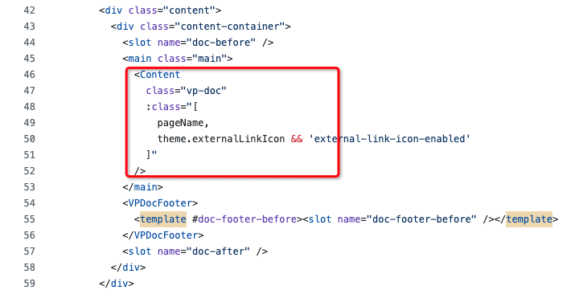

# 用 VitePress 搭建电子书，绝了！

大家好，我是杨成功。

自从《前端开发实战派》出版以后，好多买过的小伙伴都联系我，问我有没有电子书？纸质书在公司看不方便，一些现成的代码没办法复制。

确实没有电子版，我也听大家的建议上微信读书，结果那边审核没通过。我想不行我自己搞一个电子书呗，给买了纸书的朋友免费阅读，方便他们随时查阅。

经过一番调研，`VitePress` 的 UI 我最喜欢，扩展性也非常好，所以就用它来搭建。


## 新建项目

在一个空文件夹下，使用命令生成项目：

```sh
$ npx vitepress init
```

全部使用默认选项，生成结构如下：


图中的 `.vitepress/config.mts` 就是 VitePress 的配置文件。另外三个 `.md` 文件是 Markdown 内容，VitePress 会根据文件名自动生成路由，并将文件内容转换为 HTML 页面。

为了代码更优雅，一般会把 Markdown 文件放在 `docs` 目录下。只需要添加一个配置：

```js
// config.mts
export default defineConfig({
  srcDir: 'docs',
});
```

改造后的目录结构是这样：


安装依赖并运行项目：

```sh
$ yarn add vitepress vue
$ yarn run docs:dev
```

## 前期设计的难点

电子书的内容不完全对外开放，只有买过纸书的人才能阅读。和掘金小册差不多，只能看部分内容，登录或购买后才能解锁全部章节。

而 VitePress 是一个静态站点生成器，默认只解析 Markdown。要想实现上述的功能，必须用到纯 Vue 组件，这需要通过[扩展默认主题](https://vitepress.dev/zh/guide/extending-default-theme)来实现。

扩展默认主题，也就是扩展 VitePress 的原始 Vue 组件，达到自定义的效果。

遵循这个思路，我们需要扩展的内容如下：

- 添加登录页面，允许用户登录。
- 添加用户中心页面，展示用户信息、退出登录。
- 修改头部组件，展示登录入口。
- 页面根组件，获取当前用户状态。
- 修改内容组件，无权限时不展示内容。

当然了还需要接入几个接口：

- 登录/注册接口。
- 获取当前用户信息接口。
- 验证当前用户权限的接口。

## 扩展默认主题

扩展默认主题，首先要创建一个 `.vitepress/theme` 文件夹，用来存放主题的组件、样式等代码。该文件夹下新建 `index.ts` 表示主题入口文件。

入口文件导出主题配置：

```js
// index.ts
import Layout from './Layout.vue';

export default {
  Layout,
  enhanceApp({ app, router, siteData }) {
    // ...
  },
};
```

上面代码导入了一个 `Layout.vue`，这个组件是自定义布局组件：

```vue
<!-- Layout.vue -->
<script setup>
import DefaultTheme from 'vitepress/theme';

const { Layout } = DefaultTheme;
</script>

<template>
  <Layout>
    <template #nav-bar-content-after>
      <button>登录</button>
    </template>
  </Layout>
</template>
```

为啥需要这个组件呢？因为该组件是项目根组件，可以从两个方面扩展：

（1）使用自定义插槽。

`Layout` 组件提供了许多插槽，允许我们在页面的多处位置插入内容。比如上面代码中的 `nav-bar-content-after` 插槽，会在头部组件右侧插入登录按钮。

具体有哪些插槽，详见[这里](https://vitepress.dev/zh/guide/extending-default-theme#layout-slots)。

（2）做全局初始化。

当刷新页面时，需要做一些初始化操作，比如调用接口、监听某些状态等。

这个时候可以使用 Vue 的各种钩子函数，比如 onMounted：

```vue
<!-- Layout.vue -->
<script setup>
import { onMounted } from 'vue';
onMounted(() => {
  console.log('初始化、请求接口');
});
</script>
```

## 如何定制内容组件？

VitePress 的内容组件，会把所有 Markdown 内容渲染出来。但是如果用户没有登录，我们不允许展示内容，而是提示用户登录，就像掘金小册这样：


定制内容组件，核心是在内容渲染的区域加一个判断：如果用户登录且验证通过，渲染内容即可；否则，展示类似上图的提示登录界面。

接下来我翻了 VitePress 的源码，找到了这个名为 `VPDoc.vue` 的组件：

> https://github.com/vuejs/vitepress/blob/main/src/client/theme-default/components/VPDoc.vue

在上方组件大概 46 行，我找到了内容渲染区域：



就在这个位置，添加一个判断，就达到我们想要的效果了：

```js
<main class="main">
  <Content
    class="vp-doc"
    v-if="isLogin"
    :class="[
      pageName,
      theme.externalLinkIcon && 'external-link-icon-enabled'
    ]"
  />
  <div v-else>
    <h4>登录后阅读全文</h4>
    <button>去登录</button>
  </div>
</main>
```

那怎么让这个修改生效呢？

VitePress 提供了一个 [重写内部组件](https://vitepress.dev/zh/guide/extending-default-theme#overriding-internal-components) 的方案。将 VPDoc.vue 组件拷贝到本地，按照上述方法修改，重命名为 `CusVPDoc.vue`。

在配置文件 `.vitepress/config.ts` 中添加重写逻辑：

```js
// config.ts
export default defineConfig({
  vite: {
    resolve: {
      alias: [
        {
          find: /^.*\/VPDoc\.vue$/,
          replacement: fileURLToPath(new URL('./components/CusVPDoc.vue', import.meta.url)),
        },
      ],
    },
  },
});
```

这样便实现了自定义内容组件，电子书截图如下：


## 添加自定义页面

添加自定义页面，首先要创建一个自定义组件。

以登录页面为例，创建一个自定义组件 `CusLogin.vue`，编写登录页面和逻辑，然后将其注册为一个全局组件。在 Markdown 页面文件中，直接使用这个组件。

注册全局组件的方法，是在主题入口文件中添加以下配置：

```js
// .vitepress/theme/index.ts
import CusLogin from './components/CusLogin.vue'

export default {
  ...
  enhanceApp({ app}) {
    app.component("CusLogin", CusLogin); // 注册全局组件
    // ...
  },
} satisfies Theme;
```

最后，新建 Markdown 文件 `login.md`，写入内容如下：

```md
---
layout: page
---

<CusLogin />
```

现在访问路由 “/login” 就可以看到自定义登录页面了。


## 全局状态管理

涉及到用户登录，那么必然会涉及在多个组件中共享登录信息。

如果要做完全的状态管理，不用说，安装 Pinia 并经过一系列配置，可以实现。但是我们的需求只是共享登录信息，完全没必要再装一套 Pinia，使用 `组合式函数` 就可以了。

具体怎么实现，在另一篇文章 [Vue3 新项目，没必要再用 Pinia 了！](https://juejin.cn/post/7348680291937435682) 中有详细介绍。

## 接入 Bootstrap

自定义页面，总是需要一个 UI 框架。上面的登录页面中，我使用了 Bootstrap。

Vitepress 使用 UI 框架有一个限制：`必须兼容 SSR`。因为 Vitepress 本质上使用了 Vue 的服务端渲染功能，在构建期间生成多个 HTML 页面，并不是常见的单页面应用。

这意味着，Vue 组件只有在 `beforeMount` 或 `mounted` 钩子中才能访问 DOM API。

而 Bootstrap 不需要打包构建就可以使用 UI，非常适合 Vitepress。

首先安装 Bootstrap：

```sh
$ yarn add bootstrap
```

然后在主题入口文件中引入 Sass 和 JS 文件：

```js
import 'bootstrap/scss/bootstrap-cus.scss';
import 'bootstrap/dist/js/bootstrap.bundle.min.js';
```

按常理说，这样就可以了，但是实际运行会报错：找不到某个 DOM API。

还记得那个限制吗？必须兼容 SSR！因此不能直接引入 JS 文件。

解决方法是在自定义布局组件 `Layout.vue` 中通过异步的方式引入：

```js
// .vitepress/theme/Layout.vue
onMounted(() => {
  import('bootstrap/dist/js/bootstrap.bundle.min.js');
});
```

这样就大功告成了，你可以使用 Bootstrap 中丰富的 UI。

最终的电子书效果：[《前端开发实战派》](https://ebook.ruidoc.cn/)，欢迎点评。

最后留一个思考题：Vitepress 支持主题切换，Bootstrap 也分浅色和深色主题；切换 Vitepress 主题时，如何同步更改 Bootstrap 的主题呢？

> 公众号：[程序员成功](https://static.ruidoc.cn/wxpub.png)  
> 作者微信：[杨成功](https://static.ruidoc.cn/ruiwx.jpeg)
