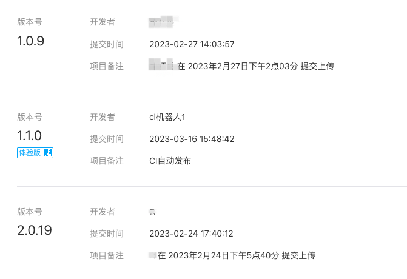
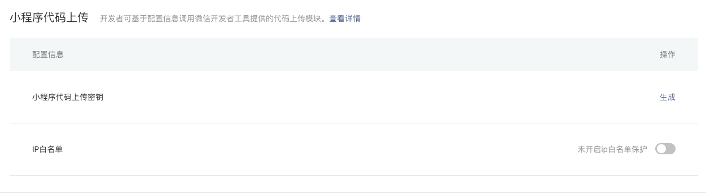
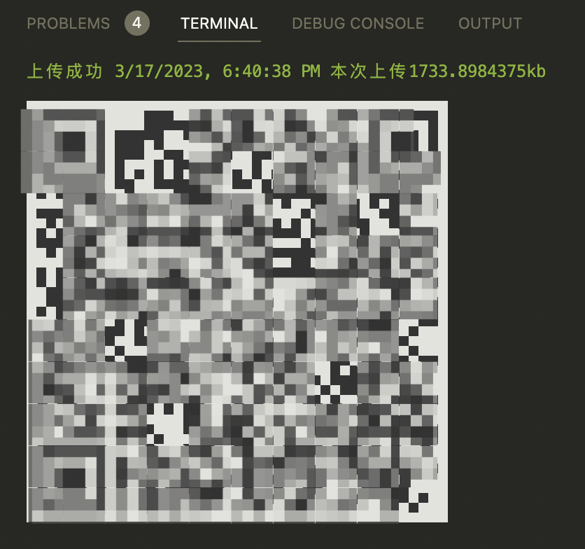

# Taro 小程序持续集成

传统意义上的持续集成，是在 Web 端通过自动化的方式将项目打包并上传到服务器，这一过程需要 Git 参与。持续集成的目的是为了免去手动打包、手动上传这一繁琐且容易出错的步骤，提高部署效率和部署的安全性。

而小程序部署方式与 Web 端不同，它不需要在本地打包，点击开发者工具中的上传按钮就会发布版本，版本可以在小程序管理后台看到。当需要其他人测试时，将某个版本设置为体验版，然后分享体验版二维码即可。

## 为什么小程序也需要持续集成？

在实际开发中我们遇到了这样的问题：每个前端人员上传后会产生一个新版本，不同的人上传后需要测试时，就要登录到管理后台切换体验版，在频繁测试场景下这个过程非常繁琐。



那么如何处理呢？解决方案就是将某个固定的版本号设置为体验版（如上图中的 v1.1.0），每个人都在这个版本号下上传，这样就不需要在后台切换版本了。多人在一个版本号下上传，开发者工具办不到，此时需要集成 CI 的能力。

## Taro 集成 CI

我司小程序是基于 Taro 开发的，Taro 提供了官方插件 @tarojs/plugin-mini-ci 来支持持续集成。使用方式也很方便，文档在 [这里](https://docs.taro.zone/docs/plugin-mini-ci)

我们以微信小程序为例，介绍接入持续集成的正确姿势。

> 注意：小程序持续集成至少需要 Taro v3.6.2 的版本，之前的版本会报错，请注意升级。

#### 1. 小程序后台升成上传密钥。

用代码的方式上传小程序，必然需要微信提供一个凭证，这个凭证就是上传密钥。在小程序后台找到【开发->开发管理->开发设置】，会看到“小程序代码上传”面板。点击“生成”按钮，根据步骤创建密钥并下载。



下载后将密钥命名为 private.key，然后将其保存在项目的 config 目录下。

#### 2. 安装插件并配置

在终端执行命令：

```sh
$ yarn add @tarojs/plugin-mini-ci -D
```

在配置文件 config/index.js 中引入插件并配置：

```js
const ciPlugin = {
  // 微信小程序
  weapp: {
    appid: 'xxxxx',
    privateKeyPath: 'config/private.key',
  },
  // 版本号
  version: '1.1.0',
  // 版本发布描述
  desc: 'CI自动发布',
}

const config = {
  ...
  plugins: [
    ['@tarojs/plugin-mini-ci', ciPlugin]
  ],
}
```

配置中的 weapp 选项表示微信小程序配置，传入小程序的 appid，属性 privateKeyPath 表示下载后的上传密钥的路径（相对路径）。简单两步，配置就完成了。

#### 3. 添加上传命令

Taro 编译微信小程序时，通过命令 `taro build --type weapp` 来实现。如果要在编译之后自动上传代码，也就是触发我们上一步集成的 CI 插件，只需要添加一个 `--upload` 参数。

我们将编译并上传单独设置为一个命令，在 package.json 中设置如下：

```json
{
  "scripts": {
    "upload": "taro build --type weapp --upload"
  }
}
```

在终端执行 `yarn run upload` 命令，控制台开始执行打包，完成后会自动将代码上传并设置为体验版，同时在控制台中自动打印出体验版的二维码，如图：



现在我们直接截图分享二维码即可，再也不需要登录管理后台了。

## @tarojs/plugin-mini-ci 原理解密

在 Taro 中使用该插件集成 CI 很简单，但如果你的小程序不是使用 Taro 开发，应该如何实现持续集成呢？下面我们解析下该插件的原理。

#### 1. miniprogram-ci

小程序代码上传是微信支持的功能，微信团队发布了一个叫 [miniprogram-ci](https://www.npmjs.com/package/miniprogram-ci) 的 NPM 包，支持在 Node.js 中上传小程序代码。使用 @tarojs/plugin-mini-ci 插件时我们传入的配置，其实就是 miniprogram-ci 的配置。

在 Node.js 中，miniprogram-ci 的用法如下：

```js
const ci = require('miniprogram-ci');
// ci项目实例
const project = new ci.Project({
  appid: 'wxsomeappid',
  type: 'miniProgram',
  projectPath: 'the/project/path',
  privateKeyPath: 'the/path/to/privatekey',
});
// 开始上传
const uploadResult = await ci.upload({
  project,
  version: '1.1.0',
  desc: 'CI自动发布',
  onProgressUpdate: console.log,
});
console.log(uploadResult);
```

上传代码之后，我们还需要将体验码生成并输出到控制台。

#### 2. 生成体验码

在小程序中扫描体验码，会打开当前小程序的体验版页面，其实这个页面是 H5 页面，地址如下：

```
https://open.weixin.qq.com/sns/getexpappinfo?appid=xxx#wechat-redirect
```

在链接中替换为自己的 appid，就可以将链接生成一个二维码输出到控制台，这里要借助另一个 NPM 包 `qrcode` 来实现。

首先安装 qrcode：

```sh
$ yarn add qrcode
```

然后编写一个将链接生成二维码，并输出到控制台的方法：

```js
import * as QRCode from 'qrcode';
const printQrcode = async (url) => {
  let terminalStr = await QRCode.toString(url, { type: 'terminal', small: true });
  console.log(terminalStr);
};

// 生成二维码并输出到控制台
const url = 'https://open.weixin.qq.com/sns/getexpappinfo?appid=xxx#wechat-redirect';
printQrcode(url);
```

在代码上传完成后调用 `printQrcode()` 方法，即可打印出体验码。

## 总结

本篇介绍了如何在 Taro 中使用插件集成 CI，并解释了插件的原理帮助大家在非 Taro 环境下集成，整体实现并不困难。

但小程序有自己的场景，一般情况下 CI 只针对体验版。我们将上传代码封装为 `upload` 命令，你可以在本地执行，当然也可以在如 GitHub Action 的自动化流水线中执行。

如果有小伙伴对 Taro 跨端开发有兴趣，欢迎加我微信  `ruidoc`  拉你进入前端工程与架构群，或者关注我的公众号  [程序员成功](https://www.ruims.top/static/wxpub.png)  查看更多文章。

再次感谢您的阅读～
