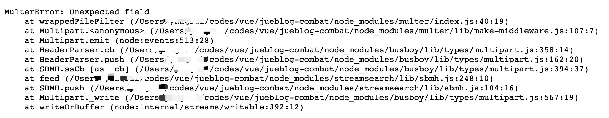
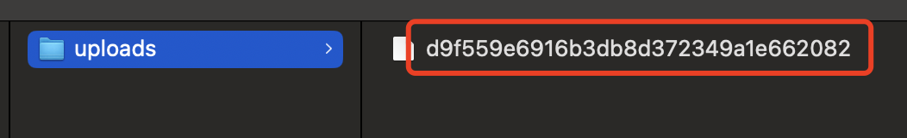
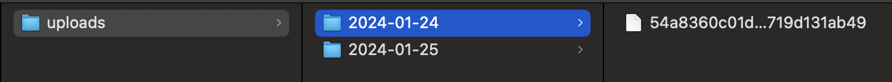

# Node.js 文件上传

大家好，我是杨成功。

前段时间我开源了 “仿稀土掘金” 博客系统，实现了掘金的文章和沸点功能，地址在 “这里”。考虑到服务器资源有限，我没有加上传图片的功能。

这几天有小伙伴说想要上传图片，还说上传前可以压缩一下，服务端不会占用很多资源。

我想想也是，所以安排上。

功能分前端和后端两部分实现：前端选择和压缩图片，后端接收和存储图片。

## 后端实现上传接口

后端使用 Express 框架，如果上传文件，需要用到 `multer` 模块。

首先安装：

```sh
$ yarn add multer
```

使用 multer 最简单的方式，就是指定一个存储路径，并在 Express 路由中添加一个接收字段：

```js
// 导入模块
const multer = require('multer');
const upload = multer({ dest: 'uploads/' });

// 路由
app.post('/upload', upload.single('avatar'), function (req, res, next) {
  // req.file 就是接受到的文件
  let { path, filename } = req.file;
  res.send('ok');
});
```

上方代码中的 `uploads/` 是文件存储路径，`avatar` 是上传文件的字段名。

如果 `req.file` 的值为空，说明没有接收到文件，做一个异常处理：

```js
if (!req.file) {
  res.status(400).send({ message: '没有接收到文件' });
}
```

如果上传文件指定的字段不是 avatar，那么请求不会走到路由中，而是直接抛出异常。



如果定义了错误处理中间件，该异常会走到错误处理中间件中，你可以输出 JSON 格式的错误。

上传成功后，文件被存储在 uoloads 文件夹下，是这样的：



可以看到，文件被重命名为 32 位的随机字符串，并且没有后缀！

### 重命名文件并添加后缀

不知道为啥，上面的方式上传后不生成文件后缀，可能是我姿势不对，有了解的同学麻烦告诉我。

手动处理文件名，需要用 `diskStorage` 实现，如下：

```js
const storage = multer.diskStorage({
  destination: (req, file, cb) => {
    cb(null, '/uploads');
  },
  filename: (req, file, cb) => {
    cb(null, file.fieldname + '.后缀名');
  },
});
const upload = multer({ storage });
```

其中，`destination` 方法用于生成文件目录，`filename` 方法用于生成文件名。

为了防止同名文件被覆盖，使用 `crypto` 模块生成指定长度的文件名，使用 `path` 模块获取文件后缀，最后拼接起来就是完整文件名：

```js
const path = require('path')
const crypto = require('crypto')

filename(req, file, cb) {
  let length = 12 // 文件名长度
  let random_name = crypto
    .randomBytes(Math.ceil(length / 2))
    .toString('hex')
    .slice(0, length) // 随机字符
  let { fieldname, originalname } = file
  let after = path.extname(originalname) // 文件后缀
  cb(null, random_name + after)
}
```

生成目录时，如果是多层级目录，无法自动创建。因此要先创建目录，再保存。

我想把每日上传的文件存储在单独的目录中，就要通过日期动态创建目录，方法如下：

```js
const fs = require('fs')
const dayjs = require('dayjs')

destination(req, file, cb) {
  let dirpath = 'uploads/' + dayjs().format('YYYY-MM-DD')
  // 目录不存在，则递归创建
  if (!fs.existsSync(dirpath)) {
    fs.mkdirSync(dirpath, { recursive: true })
  }
  cb(null, dirpath)
},
```

最终的效果：



### 多文件上传

上面的方法是单文件上传，下面看怎么实现多文件上传。

目录和文件的处理逻辑一样，也就是 `diskStorage` 的部分呢不用动，只要区分单文件和多文件怎么接收。

- upload.single('image')：接收单文件，通过 `req.file` 获取文件。
- upload.array('images')：接收多文件，通过 `req.files` 获取文件

定义一个接收多文件的路由：

```js
const upload = multer({ storage });

router.post('/uploads', upload.array('images', 4), (req, res) => {
  let files = req.files
  if (!files || files.length == 0) {
    return res.status(400).send({ message: '文件不能为空' })
  }
  res.send({
    data: files.map(file => ({
      path: file.path
      filename: file.filename,
    })),
  })
})
```

上方代码中，upload.array('images', 4) 表示上传字段是 `images`，最多一次上传 4 个文件。

也可以限制单个文件的上传大小，比如不超过 1M：

```js
const upload = multer({
  storage,
  limits: {
    fileSize: 1024 * 1024, // 限制文件大小为1MB
  },
});
```

## 前端选择并上传文件

前端实现相对简单一些，我们看 3 种常用的上传文件方法。

### 原生 HTML + JavaScript 上传

定义一个上传文件的输入框：

```js
<imput type="file" onchange="toupload(this)" />
```

获取到文件后，使用 `FormData` 添加文件，并通过 `fetch` 方法实现单文件上传：

```js
const toupload = async (e) => {
  let file = e.files[0];
  let form_data = new FormData();
  form_data.append('image', file, file.name);
  try {
    const response = await fetch('http://xxx/upload', {
      method: 'POST',
      body: form_data,
      headers: {
        'Content-Type': 'multipart/form-data',
      },
    });
    let data = await response.json();
    console.log('上传成功:', data);
  } catch (error) {
    console.error('上传失败:', error);
  }
};
```

如果是多文件上传，只需要修改选择文件的部分：

```js
let files = e.files;
let form_data = new FormData();
for (let i = 0; i < files.length; i++) {
  form_data.append('images', files[i], files[i].name);
}
```

### 上传前压缩文件

如果前端选择了非常大的文件上传，不光会占用服务器带宽，还会大量占用服务器存储空间。

解决这个问题，可以在选择文件后获取文件大小，大于某个值拒绝上传。

实际情况是，用户不会先把文件压缩了，再来上传，除非迫不得已。所以应该先判断文件大小，大于某个值自动压缩文件。

文件压缩使用 `image-conversion` 这个包，写一个压缩函数：

```js
import { compressAccurately } from 'image-conversion';

const compressImg = (file: File) => {
  // 压缩后的最大值
  let maxsize = 300;
  // 判断文件类型
  let typeList = ['image/jpeg', 'image/png', 'image/gif'];
  let isValid = typeList.includes(file.type);
  let need_press = file.size / 1024 > maxsize;
  if (!isValid) {
    alert('图片格式只能是 JPG/PNG/GIF!');
  }
  return new Promise((resolve, reject) => {
    if (!isValid) {
      return reject();
    }
    if (!need_press) {
      // 不需要压缩，直接返回文件
      return resolve(file);
    }
    compressAccurately(file, maxsize).then((res) => {
      resolve(res);
    });
  });
};
```

选择文件后，使用这个方法压缩文件，返回新文件，如下：

```js
var final_file = compressImg(file);
```

### Vue3 + Element Plus 文件上传

Element Plus 有一个文件上传组件，有两种上传方式：自动上传和手动上传。

自动上传需要指定上传接口地址，如下：

```js
<el-upload
  action="http://xxxx/upload"
  name="image"
  :headers="headers"
  :show-file-list="false"
  :multiple="false"
  :on-success="uploadSuccess"
  :before-upload="compressImg"
>
  <el-button class="actmo" plain>上传</el-button>
</el-upload>
```

一般上传文件接口可能有 JWT 验证，所以请求时要带请求头，通过 headers 属性传递：

```js
const headers = {
  Authorization: `Bearer ${localStorage.token}`,
};
```

组件中的 `before-upload` 在文件选择后、上传前触发，这里用来执行文件压缩。当上传成功后，`on-success` 指定的函数触发，参数是上传接口的返回值。

单文件上传，使用上面的自动上传即可。多文件上传，如果要展示文件列表，这里要用手动上传。

```js
<el-upload
  v-show="fileList.length > 0"
  v-model:file-list="fileList"
  action="#" // 不指定上传地址
  list-type="picture-card"
  :auto-upload="false" // 手动上传
  :on-success="uploadSuccess"
></el-upload>
```

上方代码绑定的 `fileList` 属性存储的是文件列表，当点击上传时，将文件列表的文件手动上传，方法和前面的 `toupload()` 方法一致，根据需要看是否压缩。
