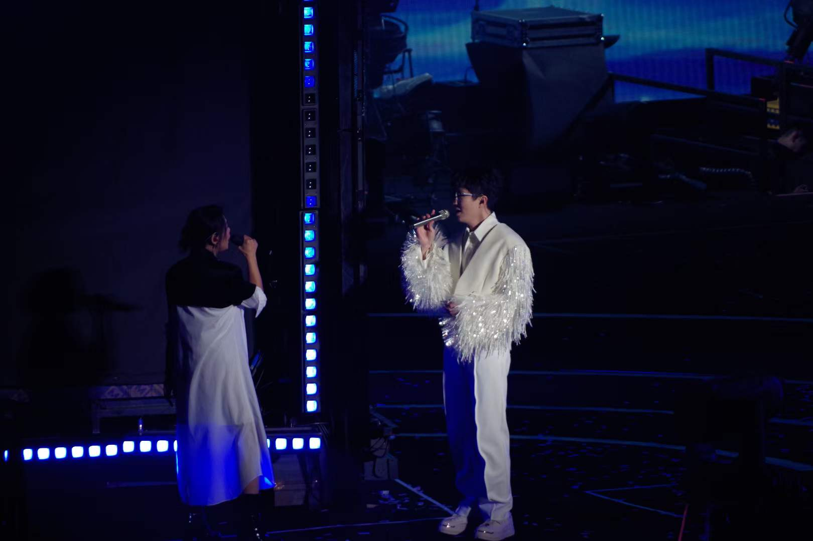
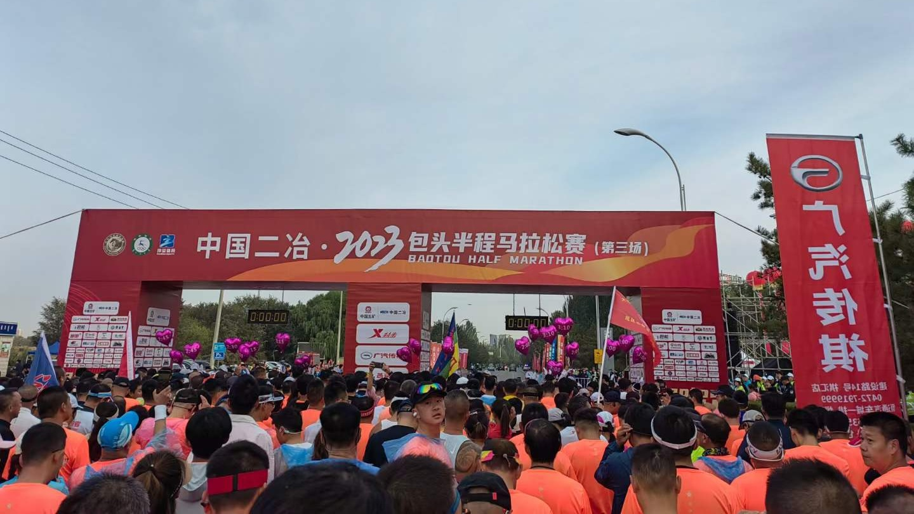

# 经济下行，我的 2023 关键字：写书、摄影、马拉松

大家好，我是杨成功。

2023 年想必大家的感受都一样：互联网行业阵阵寒潮，裁员降薪远没到终点。我也终于放下了执着多年的“大厂梦”。很多时机错过了就没有了，硬追没用，倒不如调整方向，拓展新路子。

这几年我的精力几乎都花在了工作上，因为只要提升技术，基本都能踩上“面试->跳槽->涨薪”的正循环。今年开始这个逻辑算是被推翻了，大家都求稳，如果不为了跳槽，All In 技术并不会带来多少成果。

所以，在经历了一段迷茫期后，我决定把空闲时间从技术中抽出来，投入到生活中，开启多线任务。

## 花了一年多时间，写一本《前端开发实战派》

写书是工作之外的第一条线，是一项耗时耗力的大工程。在写书前我已经写了一年多的文章，为什么能坚持写下去呢？其实主要有两个原因。

第一个原因是为了抗遗忘。大家可能有这种感受，研究一个新问题的时候，花了好几个小时终于豁然开朗。你以为吃透了，然而三天后再看这个问题，怎么好陌生。如果当时没有把关键点记录下来，后面你就得重理一遍。

第二个原因是整理思路。大家经常会看各种框架、类库的文档，读了两遍好像读懂了。但当你尝试着总结一下，会立刻发现问题。原因很简单，没有真正理解是写不出来的。我经常边看文档边总结，写完了基本就掌握了。

所以，写文章的好处多多，写书是写文章的一个升级，它的内容和要求更上一层。写一篇文章可以整理几天或几周的思路，写书可能要整理好几年的知识。

我工作已经七年了，确实想把积攒的经验整理成一本书。所以从去年开始，整整一年多的时间都在写它，几乎耗费了我所有的下班和周末时间。写书费力不赚钱，那你说值吗？其实要看为什么写书。

如果是单纯为了赚钱，那不如去录课。我写《前端开发实战派》的主要驱动力是总结有实战价值的内容，工作中能用的到，能解决问题，可以时常翻着看，我会非常有成就感。我始终认为能帮助我们做好项目、解决好问题的技术，才更具有实战价值。这本书就是围绕这个方向来写的。

写书还有一个特点，它是对一个人耐力和自控力的考验。上班的时候你被老板看着、需求推着，沉浸式写代码根本不觉得啥。但你要想在下班时间写点东西，各种诱惑就来了。比如坐一会就想躺床上，没写几个字思想飞走了；一会想去厕所，一会又想吃点东西，反正是静不下心来。

当然，最要命的还是手机。这几年抖音带我们看遍了世界，但也抽走了你的专注能力。大家一有空闲就想刷，一刷就停不下来，这已经形成了肌肉记忆。因此当你在绝对自由的情况下，想安心读一本书、学习一点知识，是一个无比困难的事情。

所以写书这一年也是我与短视频对抗的一年。其实按照我的进度差不多半年多就写完了，最后搞了一年。很多个周末都是对抗短视频失败，在刷视频中消耗掉了。

我相信有很多人应该和我一样，掌控不了自己的感觉是真的难受。

但是好在新书顺利完结。给大家看看新书的封面吧，元旦前后就能拿到实体书了。

## 主动社交第一步：给陌生人拍照

搞技术的这些年，我能明显感受到社交能力退化，不擅长一切与人打交道的活动。有社交场面我会不自觉地想回避，甚至害怕，没错就是社恐。而且身边熟人大部分都是男生，如果和女生打交道，社恐程度直接翻倍。

今年的形势让我有了一个担忧：好像除了写代码，别的我啥都不会；如果哪天我失业了，或者写代码赚不到钱了，我还能干啥？因此我一直想着储备一个“第二技能”。

既能锻炼社交能力、又可以作为第二技能培养、我还感兴趣的，好像只有一件事 ——— 摄影。

我说的摄影主要指人像摄影。抖音上有很多给小姐姐免费拍照的博主，他们就是从路上抓人，问人家方不方便拍照，可以的话边拍照边交流，整个过程既锻炼社交能力又锻炼拍照技术。

为啥必须拍人呢？因为拍人需要你主动打招呼，主动社交，这正是我们广大社恐人士害怕且需要锻炼的地方。而拍照是一个很自然的方式，一般小姐姐们都愿意。在拍摄过程中你们还会沟通怎么拍好看，不用担心没话说。再者如果未来真要靠这个第二技能赚钱，那只能是拍人了。

确定了摄影的目标，我就开始挑选相机了，拍人必须佳能啊。经过一系列对比，最后选择了轻量级微单 ——— 佳能 R10，它长这样：

收到相机的第一个周末，我就带着它去颐和园试拍。夏天的颐和园人超多，全是拍照的，你带一个相机帮别人拍照，只要不是技术太烂，很多人还是很乐意的。

第一天拍了好几个小姐姐，其中有一个俄罗斯人、一个法国人。这两人很有意思，我打招呼的时候操着蹩脚的英语问：“Can I take photes for you”？然后两人愣了一下，互相看了看显然没听懂我说啥（不知道是人家不说英文，还是我口语太烂），然后用中文问：“是拍照吗？”，我说对对对，场面一度有点好笑。

给大家看看照片吧：

拍完后俩人惊呼：“哇拍的太好了，我们太喜欢了”。虽然是夸张式的客气吧，但这种感觉很治愈，和掘金评论区有人说“大佬牛逼”的感觉还是有点不一样的。

后来我又去圆明园拍，什刹海拍，奥森拍，总之拍了很多，拍的过程中也慢慢学会了相机的各种档位和参数。这期间我也升级了装备，入了一个大光圈 50mm 定焦人像镜头，出片效果更好了。虽然和陌生小姐姐打招呼还是社恐，不过也自然了一点点。

当然新手期是有阵痛的。有一次在什刹海拍，拍了几张小姐姐说看一眼，看完后眉头一皱说：“拍的不好看，我不拍了，你把我的照片删了吧”。我当时心里一愣，这么直接？有点没反应过来。然后这个小姐姐盯着我删了照片。就真的很尴尬，那天真的打击到我了。

回家后我开始平复心情，告诉自己很正常啊，本来就是新手练级期嘛，就算是高手也不是人人都满意啊。再说了本来就是在干一件突破舒适圈的事情，这个结果很正常，小问题，能接受。

后来还刷到了类似情况的视频，但摄影大哥说了句：“删一张 50”。直接给我整笑了。不过多数拍摄过程还是很愉快的。

最后给大家看几张我拍的还不错的照片吧：

## 看了毛不易的演唱会

喜欢毛不易很多年了，一是因为他唱歌好听，二是因为他的性格、经历和我极度相似。有时候在节目上看他的状态表现，就跟看我自己一样。今年他终于在北京开演唱会了，票很难抢，我搞了张黄牛票去的。

到现场后发现很多粉丝小姑娘在卖毛老师周边，全是黄色的。我买了一把手工做的扇子，特别精致，是这样的：

买扇子的时候我问还有别的颜色吗？然后那个小姑娘看假粉丝一样地看着我说：“黄色是毛毛的应援色啊”。应援色？好吧你们这些年轻人。

演唱会现场极其沸腾，估计有四分之三是女粉，而且学生比较多。毛老师出场的时候，人未现身歌声先至，全场迎来了第一波尖叫，马上整个场子都齐刷刷的喊一句话，我又懵了，后来知道这是应援口号。

不过听歌咱肯定是真粉。特别有感触的是唱《无问》的时候，毛老师唱：

“如果光，已忘了要将前方照亮，你会握着我的手吗？”

全场大喊：“会！”

“如果路，会通往不知名的地方，你会跟我一起走吗？”

全场大喊：“会！”

唱《一荤一素》的时候，有个男粉带头喊“毛不易加油”，大家都给这个大男孩加油。

嘉宾环节也是大惊喜，毛老师请来了刘若英，先是全场大合唱《像我这样的人》，然后大合唱《后来》，直接点爆了演唱会高潮。现场大合唱的那个气氛，哇是真的绝。

去的时候我还借了一支长焦镜头，给大家看现场图：

  

两个半小时的演唱会真的太快了。不过我还是幸运的，那几天正好下大雨，本来第二天还有一场，结果因为天气原因取消了。心疼第二场的粉丝们。

## 首次跑马拉松，突破了身体的极限

有小伙伴给我留言：“成功哥你这么卷，要注意身体”。其实今年开始我非常注意养生，好像年龄到了某个分水岭，很明显精力下降。再加上长期对电脑久坐，容易出毛病，所以我格外的重视锻炼。

锻炼方式主要是跑步，夏天的时候每周都要跑三四次，每次大约跑差不多两公里。

那怎么会想到跑马拉松呢？其实也是个巧合。今年老家举办马拉松系列赛，国庆节假期举办第三场，正好我回家，某天看到公众号报名推送，突然闪过一个念头：要不我也跑一下试试？

马拉松分全马和半马，全马 42 公里、半马 21 公里。我虽然经常跑步，但都是两三公里的短跑，很少跑到 5 公里。所以我就搜了一下，我这个水平有没有可能跑完半马。

网上说如果能比较轻松的完成 10 公里，跑半马就没有问题。我没跑过 10 公里，但可以试一下。当天晚上下班后，我换好衣服，计划好路线，从中国农业大学到中央民族大学，沿着公路一路向南跑。

跑到快五公里的时候我已经喘到不行了，就放慢速度坚持再坚持。坚持了一段时间好像迈过了某个临界点，呼吸竟然平稳了，但不知道为啥右腿又沉又麻，越跑越麻，最后咬着牙跑到了终点。

手机提醒 10 公里完成，一股爽快的感觉冲上脑门，我马上报了名。后来找到了右腿疼的原因，原来是跑步时右手拿手机，会导致重心右倾；短跑时没感觉，长跑时右腿承压非常明显。这个原因还是有点哭笑不得。

隔了几天二刷 10 公里，这次把手机拿在左手（我左腿发力小，刚好平衡），调整了下跑姿。10 公里下来的时候，两条腿都比较放松，感觉比上次轻松多了。

马拉松开赛当天，现场氛围拉满，起跑点上万参赛者跟着主持人喊口号，随着鸣枪声响一起开跑。21 公里的路线站满了志愿者，隔一段距离还有医护人员，当然最烘托气氛的是赛道两边的大爷大妈，看到我们跑过来大喊加油，那种热血沸腾的力量一下子就上头了，所以比赛当天我发挥的最好。

这次跑马拉松也突破了我身体的极限。开跑后平均配速每公里 5 分钟，连续跑了 15 公里中间没有停，我都有点惊讶了。15 公里之后腿部负担很重，跑一段时间会停 3 秒再跑；到 18 公里的时候岔气了，腰部左边有点疼，被医护人员看出来了问我没事吧？我赶紧说没事，调整呼吸减速慢慢地又缓解了。

全程 21 公里跑完后，我都感觉我好牛逼。给大家看一下完赛奖牌，是这样滴：

后来我复盘的时候，我就想当时是怎么做到连续跑 15 公里不停的，这远超我的平均水平。归纳了很多原因，我觉得最重要的原因是“欺骗自己”。

怎么欺骗呢？就是跑的时候没有考虑 21 公里这个事，就跟着大家跑。到 5 公里的时候感觉吃力了，我就看前面不远处有个垃圾箱，告诉自己再坚持下跑到那里歇一会；到了垃圾箱的位置感觉还能再坚持一下下，我又看前面有个树坑，告诉自己跑到树坑那就歇息。就这样一点一点的暗示自己，真的就又跑了 10 公里。

人生是一场马拉松，近几年越来越能体会到这句话的能量。要知道人的一生路很长，急于求成是人性，但不符合社会规则。我们需要磨练耐力、持久力、专注力，大目标拆小目标，一点点的完成。这是对长期主义最好的诠释。

这次马拉松跑完之后，我的跑步能力直接跃升了一级。现在晚上跑步，五公里轻轻松松，中间不需要暂停。而且每次这种慢长跑完成之后，都能明显感受到一种身体被唤醒的感觉。

程序员干久了身体很容易出毛病，坚持跑步是对抗职业病的不二之选，这也是我跑马拉松的原因之一。这行想要长久干下去，有一个健康的体魄至关重要。

## 新年展望

我很信奉白岩松的一句话：“30 岁前拼命做加法，30 岁后懂得做减法”。

加法是为了尽可能多地尝试不同的东西，在尝试中才能找到自己能干什么、喜欢什么、适合什么。减法则是在尝试过众多可能之后，选择最合适自己的那几条路，保持专注，长期做下去。

新年喜提 28 岁，做加法的时间也仅剩 2 年了。再加上我还没有找到人生伴侣，需要分很多的时间和精力在上面，所以时间非常紧迫。很明显今年做加法的动作加快了，确实我也有年龄焦虑。

打破焦虑只有两个办法：① 降低预期，② 行动起来。

新的一年，写书这条线已经结束了，能腾出不少时间。技术方面保持正常的学习吧，也不过分投入。但“摄影”和“跑步”这两条线要持续进行，还有一件要干的事，暂时保密。

摄影方面，拍照和视频会同步进行，当然还有剪辑。跑步方面，开春之后会继续报名其他城市的马拉松，让脚步留在多个城市的赛道上。

以前我只觉得马拉松是一场体育运动，但后来我发现，每个城市举办马拉松都会把最美的风景用赛道串起来。整个城市为你开辟道路，你只需要奔跑，这何不是一种更浪漫的旅行呢？

2024 年度总方针：“继续做加法，不期待不恐惧，就抱着试一试的心态，干就完了”。
