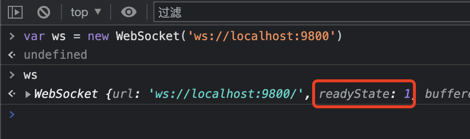

# Koa2 搭建信令服务器，JS 也能搞定视频通话！

上一篇介绍了 WebRTC 是什么，它的通信流程有哪些步骤，并搭建了本地通信的 Demo，最后讲了一对多实现的思路，原文地址：[音视频通信加餐 —— WebRTC 一探到底](https://segmentfault.com/a/1190000041517764)

在这篇文章里，我们介绍局域网两端通信的时候，用到了`信令服务器` 去传输 SDP。当时我们没有仔细介绍信令服务器，只是用两个变量来模拟连接。

在实际应用场景中，信令服务器的本质就是一台 WeSocket 服务器，两个客户端必须与这个服务器建立 WeSocket 连接，才能互相发送消息。

然而信令服务器的作用不仅仅是发送 SDP。多端通信我们一般是和某一个人或者某几个人通信，需要对所有连接分组，这在音视频通信中属于“房间”的概念。信令服务器的另一个作用是维护客户端连接与房间的绑定关系。

那么这篇文章，就基于 Node.js 的 Koa2 框架，带大家一起实现一个信令服务器。

## 大纲预览

本文介绍的内容包括以下方面：

- 再谈信令
- koa 遇见 ws
- 如何维护连接对象？
- 发起端实现
- 接收端实现
- Ready，传令兵开跑！
- 连接持久化：redis 助力
- 我想学更多

## 再谈信令

上一篇我们讲到，一个局域网内的两个客户端，需要双方多次互换信息才能建立 WebRTC 对等连接。发送信息是各端主动发起，另一端监听事件接收，因此实现方案是 `WebSocket`。

而基于 WebSocket 远程互换 SDP 的过程，被称为**信令**。

事实上，WebRTC 并没有规定用什么样的方式实现信令。也就是说，信令并不是 WebRTC 通信规范的一部分。比如我们在一个页面实现两个 `RTCPeerConnection` 实例的通信，整个连接过程就不需要信令呀。因为双方的 SDP 都定义在一个页面，我们直接获取变量就可以。

只不过在多个客户端的情况下，双方需要互相获取对方的 SDP，因此才有信令一说。

## koa 遇见 ws

我们用 Node.js 搭建信令服务器，有两个部分最关键：

1. 框架：Koa2
2. 模块：ws

Node.js 开发需要选择一个适合的框架，之前一直用 Express，这次尝尝 Koa2 香不香。不过它们两个相差不大，可能某些 API 或者 npm 包有些差异，基本结构几乎都一样。

ws 模块是非常简单纯粹的 WebSocket 实现，包含客户端和服务端。我在这篇文章 [前端架构师破局技能，NodeJS 落地 WebSocket 实践](https://segmentfault.com/a/1190000041075299) 中详细介绍了 ws 模块的用法和如何与 express 框架集成，不了解 ws 模块的可以看这篇。

这里我们直接开始搭建 Koa2 的结构以及引入 ws 模块。

### koa 项目结构搭建

首先是初始化项目并安装：

```js
$ npm init && yarn add koa ws
```

创建完成之后，生成了 `package.json` 文件，然后在同级目录添加三个文件夹：

- `routers`：存放单独路由文件
- `utils`：存放工具函数
- `config`：存放配置文件

结下来编写最重要的入口文件，基础结构如下：

```js
const Koa = require('koa')
const app = new Koa()

app.use(ctx => {
  ctx.body = 'Hello World'
})

server.listen(9800, () => {
  console.log(`listen to http://localhost:9800`)
})
```

看到没，和 express 基本一样，都是实例化之后，设置一个路由，监听一个端口，一个简单的 web 服务器就启动了。

这里要说的比较大的区别，就是她们的 `中间件函数` 的区别。中间件函数就是使用 **app.use** 或者 **app.get** 时传入的回调函数，更多中间件知识参阅[这里](https://github.com/koajs/koa/wiki#middleware)。

中间件函数的参数包含了 `请求` 和 `响应` 两大块的关键信息，在 express 中使用两个参数分别表示，而在 koa 中将这两个对象合在了一起，只用一个参数表示。

express 的表示方法如下：

```javascript
app.get('/test', (req, res, next) => {
  // req 是请求对象，获取请求信息
  // res 是响应对象，用于响应数据
  // next 进入下一个中间件
  let { query } = req
  res.status(200).send(query)
})
```

而 koa 是这样的：

```javascript
app.get('/test', (ctx, next) => {
  // ctx.request 是请求对象，获取请求信息
  // ctx.response 是响应对象，用于响应数据
  // next 进入下一个中间件
  let { query } = ctx
  ctx.status = 200
  ctx.body = query
})
```

虽然说 ctx.request 表示请求对象，ctx.response 表示响应对象，但是 koa 又把常用的一些属性直接挂到了 ctx 上面。比如 `ctx.body` 表示的是响应体，那要获取请求体怎么办呢？得用 `ctx.request.body`，然后获取 URL 参数又是 `ctx.query`，总之用起来感觉比较混乱，这部分个人还是喜欢 express 的设计。

基础结构是这样，我们还要做两个处理：

- 跨域处理
- 请求体解析

跨域嘛不用说，做前端的都懂。请求体解析是因为 Node.js 接收请求体基于流的方式，不能直接获取，因此需要单独处理下，方便用 `ctx.request.body` 直接获取到。

首先安装两个 npm 包：

```sh
$ yarn add @koa/cors koa-bodyparser
```

然后在 app.js 中配置下即可：

```js
const cors = require('@koa/cors')
const bodyParser = require('koa-bodyparser')

app.use(cors())
app.use(bodyParser())
```

### ws 模块集成

本质上来说，WebSocket 与 Http 是两套服务，虽然都集成在一个 Koa 框架里面，但它们实际上各自独立。

因为同在一个 Koa 应用，所以我们希望 WebSocket 与 Http 可以共用一个端口，这样的话，**启动/销毁/重启** 这些操作，我们只需控制一处就可以了。

要共用端口，首先对上面入口文件 app.js 做一些改造：

```javascript
const http = require('http')
const Koa = require('koa')

const app = new Koa()
const server = http.createServer(app.callback())

server.listen(9800, () => {
  console.log(`listen to http://localhost:9800`)
}) // 之前是 app.listen
```

然后我们在 utils 目录下新建 `ws.js`：

```js
// utils/ws.js
const WebSocketApi = (wss, app) => {
  wss.on('connection', (ws, req) => {
    console.log('连接成功')
  }
}

module.exports = WebSocketApi
```

再将这个文件引入 app.js 中，添加代码如下：

```js
// app.js
const WebSocket = require('ws')
const WebSocketApi = require('./utils/ws')

const server = http.createServer(app.callback())
const wss = new WebSocket.Server({ server })

WebSocketApi(wss, app)
```

此时重新运行 `node app.js`，然后打开浏览器控制台，写一行代码：

```js
var ws = new WebSocket('ws://localhost:9800')
```

正常情况下，浏览器结果如下：



这里的 **readyState=1** 说明 WebSocket 连接成功了。

## 如何维护连接对象？

上一步集成了 ws 模块，并且测试连接成功，我们把 WebSocket 的逻辑都写在 `WebSocketApi` 这个函数内。下面我们继续看这个函数。

```js
// utils/ws.js
const WebSocketApi = (wss, app) => {
  wss.on('connection', (ws, req) => {
    console.log('连接成功')
  }
}
```

函数接收了两个参数，`wss` 是 WebSocket 服务器的实例，`app` 是 Koa 应用的实例。也许你会问这里 app 有什么用？其实它的作用很简单：**设置全局变量**。

信令服务器的主要作用，就是找到连接的两方并传递数据。那么当有许多客户端连接到服务器的时候，我们就需要在众多的客户端中，找到互相通信的两方，因此要对所有的客户端连接做`标识`和`分类`。

上述代码监听 connection 事件的回调函数中，第一个参数 `ws` 就表示一个已连接的客户端。ws 是一个 WebSocket 实例对象，调用 `ws.send()` 就可以向该客户端发送消息。

```js
ws.send('hello') // 发消息
wss.clients // 所有的 ws 连接实例
```

为 ws 做标识很简单，就是添加一些属性用于区分。比如添加 **user_id**，**room_id** 等，这些标识可以在客户端连接的时候作为参数传过来，然后通过上述代码中的 `req` 参数中获取。

设置完标识后，将这个“有名有姓”的 ws 客户端保存起来，后面就能找得到了。

但是怎么保存？也就是如何维护连接对象？这个问题需要认真思考。WebSocket 连接对象是在内存当中，它与客户端连接实时开启的。所以我们要把 ws 对象存到内存里，方式之一就是设置在 Koa 应用的全局变量当中，这也是开头说到 `app` 参数的意义。

Koa 应用的全局变量在 `app.context` 下添加，所以我们以“发起端”和“接收端”为组，创建两个全局变量：

- `cusSender`：数组，保存所有发起端的 ws 对象
- `cusReader`：数组，保存所有接收端的 ws 对象

然后在分别获取这两个变量和请求参数：

```js
// utils/ws.js
const WebSocketApi = (wss, app) => {
  wss.on('connection', (ws, req) => {
    let { url } = req // 从url中解析请求参数
    let { cusSender, cusReader } = app.context
    console.log('连接成功')
  }
}
```

请求参数从 url 当中解析，`cusSender`, `cusReader` 是两个数组，保存了 ws 的实例，接下来所有的连接查找和状态维护，都是在这两个数组下面操作。

## 发起端实现

发起端是指发起连接的一端，发起端连接 WebSocket 需要携带两个参数：

- **rule**：角色
- **roomid**：房间 id

发起端的 role 固定为 `sender`，作用只是标识这个 WebSocket 是一个发起角色。`roomid` 表示当前这个连接的唯一 ID，一对一通信时，可以是当前的用户 ID；一对多通信时，会有一个类似“直播间”的概念，roomid 就表示一个房间（直播间）ID。

首先在客户端，发起连接的 URL 如下：

```js
var rule = 'sender',
  roomid = '354682913546354'
var socket_url = `ws://localhost:9800/webrtc/${rule}/${roomid}`
var socket = new WebSocket(socket_url)
```

这里为表示 webrtc 的 WebSocket 连接添加一个 url 前缀 `/webrtc`，同时我们把参数直接带到 url 里，因为 WebSocket 不支持自定义请求头，只能在 url 里携带参数。

服务端接收 sender 代码如下：

```js
wss.on('connection', (ws, req) => {
  let { url } = req // url 的值是 /webrtc/$role/$uniId
  let { cusSender, cusReader } = app.context
  if (!url.startsWith('/webrtc')) {
    return ws.clode() // 关闭 url 前缀不是 /webrtc 的连接
  }
  let [_, role, uniId] = url.slice(1).split('/')
  if(!uniId) {
    console.log('缺少参数')
    return ws.clode()
  }
  console.log('已连接客户端数量：', wss.clients.size)
  // 判断如果是发起端连接
  if (role == 'sender') {
    // 此时 uniId 就是 roomid
    ws.roomid = uniId
    let index = (cusReader = cusReader || []).findIndex(
      row => row.userid == ws.userid
    )
    // 判断是否已有该发送端，如果有则更新，没有则添加
    if (index >= 0) {
      cusSender[index] = ws
    } else {
      cusSender.push(ws)
    }
    app.context.cusSender = [...cusSender]
  }
}
```

如上代码，我们根据 url 中解析出的 sender 来判断当前连接属于发送端，然后为 ws 实例绑定 roomid，再根据条件更新 cusSender 数组，这样保证了即使客户端多次连接（如页面刷新），实例也不会重复添加。

这是发起连接的逻辑，我们还要处理一种情况，就是关闭连接时，要清除 ws 实例：

```js
wss.on('connection', (ws, req) => {
  ws.on('close', () => {
    if (from == 'sender') {
      // 清除发起端
      let index = app.context.cusSender.findIndex(row => row == ws)
      app.context.cusSender.splice(index, 1)
      // 解绑接收端
      if (app.context.cusReader && app.context.cusReader.length > 0) {
        app.context.cusReader
          .filter(row => row.roomid == ws.roomid)
          .forEach((row, ind) => {
            app.context.cusReader[ind].roomid = null
            row.send('leaveline')
          })
      }
    }
  })
})
```

## 接收端实现

接收端是指接收发起端的媒体流并播放的客户端，接收端连接 WebSocket 需要携带两个参数：

- **rule**：角色
- **userid**：用户 id

角色 role 与发起端的作用一样，值固定为 `reader`。连接端我们可以看作是一个用户，所以发起连接时传递一个当前用户的 `userid` 作为唯一标识与该连接绑定。

在客户端，接收方连接的 URL 如下：

```js
var rule = 'reader',
  userid = '6143e8603246123ce2e7b687'
var socket_url = `ws://localhost:9800/webrtc/${rule}/${userid}`
var socket = new WebSocket(socket_url)
```

服务端接收 reader 发送消息的代码如下：

```js
wss.on('connection', (ws, req) => {
  // ...省略
  if (role == 'reader') {
    // 接收端连接
    ws.userid = uniId
    let index = (cusReader = cusReader || []).findIndex(
      row => row.userid == ws.userid
    )
    // ws.send('ccc' + index)
    if (index >= 0) {
      cusReader[index] = ws
    } else {
      cusReader.push(ws)
    }
    app.context.cusReader = [...cusReader]
  }
}
```

这里 cusReader 的更新逻辑与上面 cusSender 一致，最终都会保证数组内存储的只是连接中的实例。同样的也要做一下关闭连接时的处理：

```js
wss.on('connection', (ws, req) => {
  ws.on('close', () => {
    if (role == 'reader') {
      // 接收端关闭逻辑
      let index = app.context.cusReader.findIndex(row => row == ws)
      if (index >= 0) {
        app.context.cusReader.splice(index, 1)
      }
    }
  })
})
```

## Ready，传令兵开跑！

前面两步我们实现了对客户端 WebSocket 实例的信息绑定，以及对已连接实例的维护，现在我们可以接收客户端传递的消息，然后将消息传给目标客户端，让我们的“传令兵”带着信息开跑吧！

客户端内容，我们继续看 [上一篇文章](https://segmentfault.com/a/1190000041517764) 中**局域网两端通信**和**一对多通信**的部分，然后重新完整的梳理一下通信逻辑。

首先是发起端 `peerA` 和接收端 `peerB` 均已经连接到信令服务器：

```js
// peerA
var socketA = new WebSocket('ws://localhost:9800/webrtc/sender/xxxxxxxxxx')
// peerB
var socketB = new WebSocket('ws://localhost:9800/webrtc/reader/xxxxxxxxxx')
```

然后服务器端监听发送的消息，并且定义一个方法 `eventHandel` 处理消息转发的逻辑：

```javascript
wss.on('connection', (ws, req) => {
  ws.on('message', msg => {
    if (typeof msg != 'string') {
      msg = msg.toString()
      // return console.log('类型异常：', typeof msg)
    }
    let { cusSender, cusReader } = app.context
    eventHandel(msg, ws, role, cusSender, cusReader)
  })
})
```

此时 peerA 端已经获取到视频流，存储在 `localStream` 变量中，并开始直播。我们下面开始梳理 peerB 端与其连接的步骤。

**第 1 步**：客户端 **peerB** 进入直播间，发送一个加入连接的消息：

```js
// peerB
var roomid = 'xxx'
socketB.send(`join|${roomid}`)
```

> 注意，socket 信息不支持发送对象，把需要的参数都转换为字符串，以 ｜ 分割即可

然后在信令服务器端，监听到 peerB 发来的这个消息，并找到 peerA，发送连接对象：

```js
const eventHandel = (message, ws, role, cusSender, cusReader) => {
  if (role == 'reader') {
    let arrval = data.split('|')
    let [type, roomid] = arrval
    if (type == 'join') {
      let seader = cusSender.find(row => row.roomid == roomid)
      if (seader) {
        seader.send(`${type}|${ws.userid}`)
      }
    }
  }
}
```

**第 2 步**：发起端 **peerA** 监听到 `join` 事件，然后创建 offer 并发给 **peerB**：

```js
// peerA
socketA.onmessage = evt => {
  let string = evt.data
  let value = string.split('|')
  if (value[0] == 'join') {
    peerInit(value[1])
  }
}
var offer, peer
const peerInit = async usid => {
  // 1. 创建连接
  peer = new RTCPeerConnection()
  // 2. 添加视频流轨道
  localStream.getTracks().forEach(track => {
    peer.addTrack(track, localStream)
  })
  // 3. 创建 SDP
  offer = await peer.createOffer()
  // 4. 发送 SDP
  socketA.send(`offer|${usid}|${offer.sdp}`)
}
```

服务器端监听到 peerA 发来消息，再找到 peerB，发送 offer 信息：

```js
// ws.js
const eventHandel = (message, ws, from, cusSender, cusReader) => {
  if (from == 'sender') {
    let arrval = message.split('|')
    let [type, userid, val] = arrval
    // 注意：这里的 type, userid, val 都是通用值，不管传啥，都会原样传给 reader
    if (type == 'offer') {
      let reader = cusReader.find(row => row.userid == userid)
      if (reader) {
        reader.send(`${type}|${ws.roomid}|${val}`)
      }
    }
  }
}
```

**第 3 步**：客户端 **peerB** 监听到 `offer` 事件，然后创建 answer 并发给 **peerA**：

```js
// peerB
socketB.onmessage = evt => {
  let string = evt.data
  let value = string.split('|')
  if (value[0] == 'offer') {
    transMedia(value)
  }
}
var answer, peer
const transMedia = async arr => {
  let [_, roomid, sdp] = arr
  let offer = new RTCSessionDescription({ type: 'offer', sdp })
  peer = new RTCPeerConnection()
  await peer.setRemoteDescription(offer)
  let answer = await peer.createAnswer()
  await peer.setLocalDescription(answer)
  socketB.send(`answer|${roomid}|${answer.sdp}`)
}
```

服务器端监听到 peerB 发来消息，再找到 peerA，发送 **answer** 信息：

```js
// ws.js
const eventHandel = (message, ws, from, cusSender, cusReader) => {
  if (role == 'reader') {
    let arrval = message.split('|')
    let [type, roomid, val] = arrval
    if (type == 'answer') {
      let sender = cusSender.find(row => row.roomid == roomid)
      if (sender) {
        sender.send(`${type}|${ws.userid}|${val}`)
      }
    }
  }
}
```

**第 4 步**：发起端 **peerA** 监听到 `answer` 事件，然后设置本地描述。

```js
// peerA
socketB.onmessage = evt => {
  let string = evt.data
  let value = string.split('|')
  if (value[0] == 'answer') {
    let answer = new RTCSessionDescription({
      type: 'answer',
      sdp: value[2]
    })
    peer.setLocalDescription(offer)
    peer.setRemoteDescription(answer)
  }
}
```

**第 5 步**：peerA 端监听并传递 candidate 事件并发送数据。该事件会在上一步 **peer.setLocalDescription** 执行时触发：

```javascript
// peerA
peer.onicecandidate = event => {
  if (event.candidate) {
    let candid = event.candidate.toJSON()
    socketA.send(`candid|${usid}|${JSON.stringify(candid)}`)
  }
}
```

然后在 peerB 端监听并添加 candidate：

```javascript
// peerB
socket.onmessage = evt => {
  let string = evt.data
  let value = string.split('|')
  if (value[0] == 'candid') {
    let json = JSON.parse(value[1])
    let candid = new RTCIceCandidate(json)
    peer.addIceCandidate(candid)
  }
}
```

好了，这样就大功告成了！！
