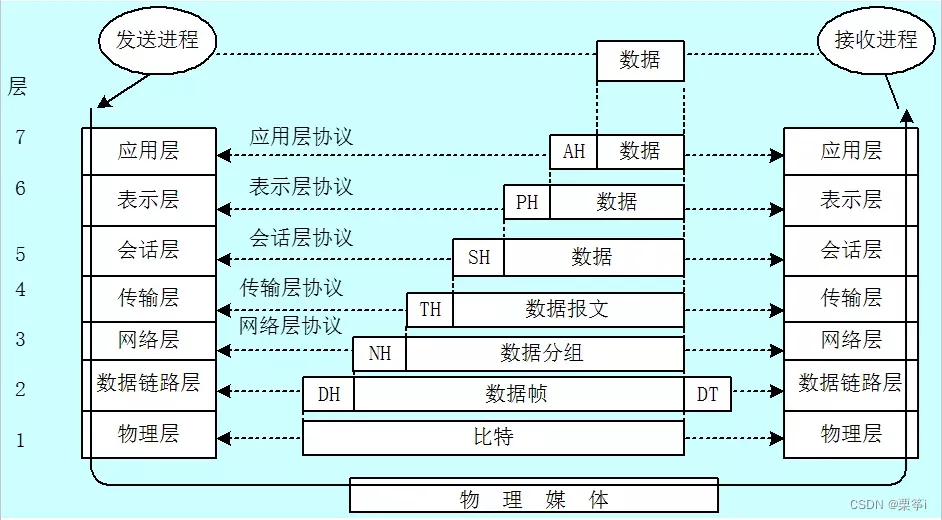
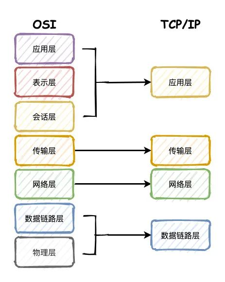

# 网络协议之网络分层

网络模型是分层的，每层处理的数据都不一样，数据单位也不一样，下面详细介绍。

## 七层网络模型

1. 物理层：通过网线、光缆等物理方式将电脑连接起来，数据单位是`比特`（Bit），传递比特流。
2. 数据链路层：把比特流封装成`数据帧`（Frame）的格式。电脑的网卡上定义了全世界唯一的 MAC 地址。然后通过广播形式向局域网内所有电脑发送数据帧。
3. 网络层：广播的形式太低效，为了区分哪些 MAC 地址属于同一个子网，网络层定义了 `IP` 和`子网掩码`，用于将数据帧分组，组成`数据包`（Packet），再通过路由器和交换机进行传输。
4. 传输层：有了网络层的 MAC+IP 地址之后，为了确定数据包是从哪个进程发送过来的，就需要`端口号`来建立通信。代表性的协议是 TCP（单位：Segment`报文段`）和 UDP（单位：Datagrams`数据报`）。
5. 会话层：负责建立和断开连接。之后的数据单位统称 `报文`（Message）。
6. 表示层：为了使得数据能够被计算机理解，将数据转换成另外一种格式，比如`文字、视频、图片`等。
7. 应用层：最高层，面对用户，提供计算机网络与最终呈现给用户的界面。

## 四层网络模型

1. 数据链路层：也称作网络访问层、网络接口层。负责把电脑连接起来。
2. 网络层：也叫做 IP 层，处理 IP 数据包的传输、路由，建立`主机间`的通信。
3. 传输层：传输层的主要工作是定义端口，标识应用程序身份，实现`端口到端口`的通信。
4. 应用层：提供了一些常用的协议规范，比如 FTP、SMPT、HTTP 等。
