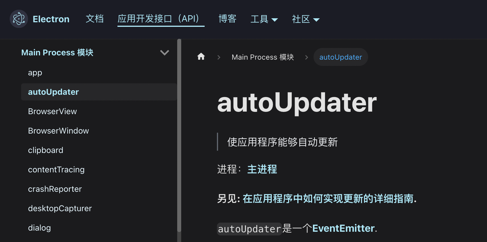
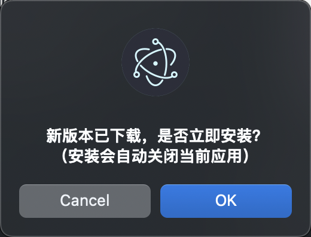

# Electron 自动更新

Electron 的自动更新不会像 React Native 一样直接下载 Web 代码静默更新，因为它还有主进程（Node.js）代码，因此需要走安装流程。

但是 Electron 的自动更新分为“全量更新”和“增量更新”。全量更新是下载完整包并安装，增量更新则是下载差异包安装，当然差异包会更小一些，这个类似 Android 包更新。

一般情况下我们都使用增量更新。在 Electron 中，使用第三方包 `electron-updater` 来实现自动更新的功能。

## 为什么不用 autoUpdater？

如果细看 Electron 文档，会发现官方提供了一个 `autoUpdater` 功能来实现自动更新，如图：



相比 autoUpdater，第三方包 `electron-updater` 有以下优势：

- 不需要搭建专门的更新服务（如 Hazel、Nuts 等）。
- 同时支持 macOS 和 Windows 签名。
- 支持获取下载进度，等等。

最主要的优势还是支持自定义更新服务。公司发布新版本安装包，上传到自己的静态服务器最方便，而不是还要再搭建一个专门的更新服务。

当然获取下载进度也很重要，否则用户干等着，体验非常差。后面我们会实现下载进度提示。

## 接入 electron-updater 并检测更新

（1）安装 electron-updater，命令如下：

```sh
$ yarn add electron-updater
```

（2）新建 `update.js` 文件，在该文件中编写更新逻辑。

定义一个 checkUpdate() 方法，在该方法中执行 autoUpdater.checkForUpdatesAndNotify() 来检测是否有新版本。

当更新完成后，执行 autoUpdater.quitAndInstall() 方法来安装更新后的应用包。代码如下：

```js
const { autoUpdater } = require('electron-updater');
var mainWin = null;

const checkUpdate = (win, ipcMain) => {
  autoUpdater.autoDownload = true; // 自动下载
  autoUpdater.autoInstallOnAppQuit = true; // 应用推出后自动安装
  mainWin = win;
  // 检测是否有更新包并通知
  autoUpdater.checkForUpdatesAndNotify().catch();
  // 监听渲染进程的 install 事件，触发退出应用并安装
  ipcMain.handle('install', () => autoUpdater.quitAndInstall());
};

module.exports = checkUpdate;
```

上方代码中，我们通过监听渲染进程的 `install` 事件来安装新包。目的是在下载完新包后先提醒用户是否安装，用户确认安装后才执行安装，强制安装会影响用户使用。

（3）在主进程中检测更新，并通知用户

检测更新是在主进程中执行的，因此在主进程中调用 checkUpdate() 方法。

checkUpdate() 方法接收两个参数，分别是渲染进程实例和主进程 IPC。主进程代码如下：

```js
const { app, BrowserWindow, ipcMain } = require('electron');
const path = require('path');
const preload = path.join(__dirname, './preload.js');
const checkUpdate = require('./update.js');

app.whenReady().then(() => {
  // 创建浏览器窗口（渲染进程）
  let win = new BrowserWindow({
    width: 600,
    height: 600,
    webPreferences: {
      contextIsolation: false,
      preload,
    },
  });
  checkUpdate(win, ipcMain);
});
```

上方代码中创建了一个浏览器窗口，并绑定了预加载脚本（preload.js）。预加载脚本负责主进程与渲染进程之间的通信，我们下一步会用到。

现在，客户检测更新的逻辑已经基本实现了。但是有新版本的判断依据是什么呢？又从哪里下载新版本呢？

下面我们编写服务器的逻辑。

## 客户端打包，上传服务器

检测更新的原理，一定是本地应用版本和线上版本的对比，因此需要将应用打包并上传到服务器。应用打包使用 electron-builder 实现。

（1）安装 electron-builder 模块：

```sh
$ yarn add electron-builder
```

（2）根目录下创建 `electron-builder.json5` 配置文件：

```json
{
  ...
  "publish": [
    {
      "provider": "generic", // 静态服务器
      "url": "https://xxx/updater/ele-app"
    }
  ]
}
```

配置文件的可选项有很多，`publish` 选项是自动更新配置。其中 **url** 属性最重要，是线上版本和安装包的地址，检测更新就是通过这个地址检测。

打包之后，我们就要将新的安装包和配置上传到服务器，并通过这个地址访问。

（3）应用打包，生成安装包和版本配置

应用的版本号取自 package.json 文件中的 version 选项。

假设当前版本号是 0.1.7，我们首先更新版本号为 0.1.8，然后使用以下命令打包：

```sh
$ electron-builder --win --x64  # 打包windows
$ electron-builder --mac --universal # 打包 Mac Intel
$ electron-builder --mac --arm64 # 打包 Mac M1
```

以 window 平台为例，打包后会生成多个文件，以下两个需要上传：

- xxx_0.1.8.exe（安装包）
- latest.yml（版本配置）

上传到服务器后，需要通过 publish 中配置的地址访问到，最终访问地址如下：

- `https://xxx/updater/ele-app/xxx_0.1.8.exe`：下载安装包。
- `https://xxx/updater/ele-app/latest.yml`：检测版本更新。

可见，latest.yml 文件用于检测更新，发现有更新后才会下载对应的安装包。

（4）配置 nginx 使访问地址生效

我们将上一步的两个文件上传到服务器的 `/data/updater/ele-app` 目录下，然后在 nginx 配置中添加一个 location 如下：

```
location /updater {
   add_header Access-Control-Allow-Origin *;
   add_header Access-Control-Allow-Credentials true;
   add_header Access-Control-Allow-Methods GET,POST;
   alias /data/updater;
   sendfile on;
   autoindex on;
}
```

使用 "nginx -s reload" 重新加载配置，访问文件的地址便生效了。

## 将下载进度通知给用户

在客户端的 update.js 文件中，我们触发了检测更新，可以添加事件监听检测结果，如下：

```js
autoUpdater.on('update-available', (info) => {
  console.log('有新版本需要更新');
});
autoUpdater.on('update-not-available', (info) => {
  console.log('无需更新');
});
```

当有新版本时，会在应用后台自动下载（因为我们配置了 autoDownload = true），此时监听下载进度并传给渲染进程，用于将其展示到用户界面上。代码如下：

```js
autoUpdater.on('download-progress', (prog) => {
  mainWin.webContents.send('update', {
    speed: Math.ceil(prog.bytesPerSecond / 1000), // 网速
    percent: Math.ceil(prog.percent), // 百分比
  });
});
autoUpdater.on('update-downloaded', (info) => {
  mainWin.webContents.send('downloaded');
  // 下载完成后强制用户安装，不推荐
  // autoUpdater.quitAndInstall();
});
```

上面代码中，主进程向渲染进程发送了 `update` 和 `downloaded` 事件，这些事件需要经过预加载脚本转发。渲染进程发送的 `install` 事件同理。

因此，在预加载脚本 preload.js 中添加代码如下：

```js
const { ipcRenderer } = require('electron');

window.elecAPI = {
  toInstall: () => ipcRenderer.invoke('install'),
  onUpdate: (callback) => ipcRenderer.on('update', callback),
  onDownloaded: (callback) => ipcRenderer.on('downloaded', callback),
};
```

现在，在浏览器窗口加载的 HTML 页面中，我们可以直接使用上述代码中的三个方法。

> 注意：在预加载脚本中使用 window.elecAPI 的前提是禁用上下文隔离，即配置 contextIsolation: false，否则会报错。详细参考 [上下文隔离](https://www.electronjs.org/zh/docs/latest/tutorial/context-isolation)。

## 界面窗口显示下载进度，完成后提示安装

在 JavaScript 中调用预加载脚本中的定义方法，即可获取到安装进度，并主动触发安装。

```js
var update_info = null; // 更新信息

window.elecAPI.onUpdate((_event, info) => {
  update_info = info;
});
window.elecAPI.onDownloaded(() => {
  update_info = null;
  let res = confirm('新版本已下载，是否立即安装？');
  if (res) {
    window.elecAPI.toInstall();
  }
});
```

如果你使用 Vue 或 React 框架，直接将 update_info 定义为状态，即可在页面中以任意方式显示新应用的下载进度了。

<!--  -->

下载完成后会弹框询问是否安装，确认后应用会退出并安装；如果取消，下一次打开应用后还会继续询问，直到用户安装。



## 总结

经过上述的好几个步骤，现在要发布新版本，只需要执行 2 个步骤。

1. 更新版本号，打包。
2. 上传到服务器。

现在用户重新打开应用程序，新包就会自动下载，并看到下载进度啦！
