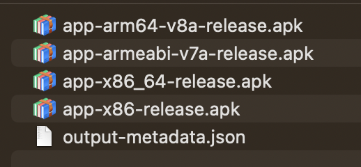

# 打包发布

使用 React Native 开发应用时，默认是在开发环境下，在 Android 中被称为 `debug` 模式。开发环境主要包含两个部分：

- Android/IOS 运行环境
- Metro 运行环境

Metro 运行环境类似于前端中的开发服务器，负责监听和打包 JS 代码。有时候我们想把开发环境的 APK 包丢给别人测试，发现是不行的，因为没有 Metro 运行环境。

> Debug 模式的 APK 安装包在这个目录下：`android/app/build/outputs/apk/debug`

所以，以安卓为例，我们看如何打一个正式的包。

## Android

Android 的正式版被称为 `release` 版本，在打包前必须做`签名`。相比于 debug 版，正式版的剔除了开发用的模块，包体积更小，版本发布也更安全。

**1. 生成签名**

签名是啥意思？其实就是给这个包绑定一个身份信息，比如是谁开发的，属于哪个公司，还需要设置一些密码。

这些身份信息都通过一个签名文件来设置。在终端使用以下命令生成签名文件：

```sh
$ keytool -genkeypair -v -storetype PKCS12 -keystore my-release-key.keystore -alias my-key-alias -keyalg RSA -keysize 2048 -validity 10000
```

上面命令比较长，直接粘贴即可，需要修改的有两处：

- my-release-key.keystore：生成的文件名。
- my-key-alias：签名的别名。

执行命令后控制台会提示你输入口令、姓名、城市等，完成后默认生成文件 `my-release-key.keystore`，我们将其拷贝到 android/app 目录下。

**2. 设置 gradle 变量**

签名生成后，将会在打包时使用。在这之前，还需要设置几个签名相关的 gradle 变量，以便在后续配置中使用。打开 android/gradle.properties 文件，在文件末尾添加变量：

```conf
MYAPP_RELEASE_STORE_FILE=my-release-key.keystore # 文件名
MYAPP_RELEASE_KEY_ALIAS=my-key-alias # 别名
MYAPP_RELEASE_STORE_PASSWORD=xxxx # 口令/密码
MYAPP_RELEASE_KEY_PASSWORD=xxxx # 口令/密码
```

**3. 添加构建配置**

构建配置文件是 android/app/build.gradle，在该文件下添加签名配置，会用到上一步设置的变量。如下：

```conf
android {
    ...
    defaultConfig { ... }
    # 签名配置
    signingConfigs {
        release {
            if (project.hasProperty('MYAPP_RELEASE_STORE_FILE')) {
                storeFile file(MYAPP_RELEASE_STORE_FILE)
                storePassword MYAPP_RELEASE_STORE_PASSWORD
                keyAlias MYAPP_RELEASE_KEY_ALIAS
                keyPassword MYAPP_RELEASE_KEY_PASSWORD
            }
        }
    }
    # 构建类型
    buildTypes {
        release {
            ...
            signingConfig signingConfigs.release # 使用的签名配置
        }
    }
}
```

仔细阅读上面配置中的备注，确认配置无误后，就可以执行打包了。

**4. 打包**

在终端进入 android 目录，然后执行命令：

```sh
$ ./gradlew assembleRelease
```

耐心等待，马上一个 release 版的 APK 包就生成了。

> Release 模式的 APK 安装包在这个目录下：`android/app/build/outputs/apk/release`

## 如何减小 APK 体积

默认情况下，即便是一个空的 React Native 项目，打包后的 APK 体积也有 100M 以上，这是非常可怕的，我们看如何减小。

**1. 依据 CPU 架构拆包**

打包后的 APK 包含所有 CPU 架构，而针对不同的架构只需要安装一个，因此我们可以将 APK 单独拆分为独立的包。方法是修改 android/app/build.gradle 的以下属性为 `true`：

```conf
def enableSeparateBuildPerCPUArchitecture = true
```

重新打包，输出结果变成了这个样子：



多数情况下真机是 ARM 架构，而模拟器是 x86 架构，按照需求安装对应版本。

> 注意，Debug 模式下不允许拆包，否则会运行错误，请将属性重新设置为 false

**2. 压缩包体积**

与前端打包时的压缩原理一样，APK 打包时可以压缩 Java 字节码。方法还是是修改 android/app/build.gradle 文件中的属性，如下：

```conf
def enableProguardInReleaseBuilds = true
```

重新打包，发现 APK 体积会变小。
