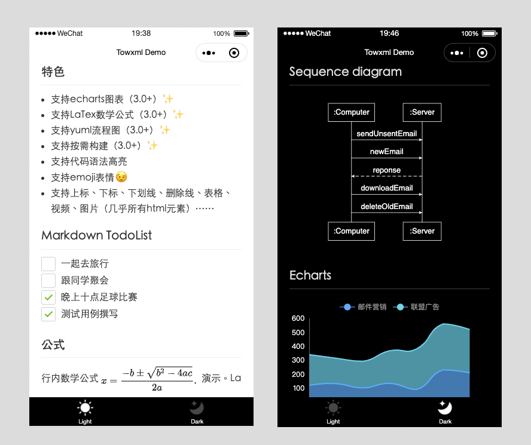

# Markdown 渲染

小程序支持渲染富文本，但是如何渲染 Markdown 是一个问题。经过调研，一款名为 [towxml](https://github.com/sbfkcel/towxml) 的第三方组件支持在小程序中渲染 Markdown。

`towxml` 除了支持基本的 Markdown 语法，还有下面三个特性是我们选择它的原因：

1. 支持 echarts 图表（3.0+）
2. 支持 LaTex 数学公式（3.0+）
3. 支持 yuml 流程图（3.0+）

小程序对体积有要求，在最新版的 Towxml3 中支持按需构建组件。比如我只想渲染 LaTex 公式，不需要 echarts 图表，那么就可以在构建时去掉 echarts 依赖，从而减小组件体积。

> 注意：Towxml 是纯微信小程序组件，在 Taro 中可以使用，但必然不能实现跨端。

Towxml 在小程序中的效果如下：



## 构建 Towxml

构建 Towxml3 需要将项目克隆到本地，修改项目并完成构建。

1. 克隆：`git clone https://github.com/sbfkcel/towxml.git`
2. 安装依赖：`yarn`
3. 修改配置：编辑 `towxml/config.js` 文件，将不需要的部分注释。
4. 构建组件：修改配置后执行 `yarn run build` 构建组件。

经过上面的 4 个步骤会输出一个 dist 文件夹，该文件夹就是生成的组件。

将 dist 改名为 towxml，并将其拷贝到 Taro 项目中，准备在 Taro 中引入该组件。

注意：这里有个坑。生成的组件中有个 `decode.json` 文件，内容如下：

```json
{
  "component": true,
  "usingComponents": {
    "decode": "/towxml/decode",
    "latex": "/towxml/latex/latex",
    "table": "/towxml/table/table",
    "img": "/towxml/img/img"
  }
}
```

如配置文件中的路径，以 `/towxml/` 开头，这就要求必须将 towxml 文件夹放到项目根目录下，这不是我们想要的。我们将文件内容修改如下：

```json
{
  "component": true,
  "usingComponents": {
    "decode": "./decode",
    "latex": "./latex/latex",
    "table": "./table/table",
    "img": "./img/img"
  }
}
```

这样 towxml 就可以放到项目的任意位置了，比如组件目录 `src/components` 下。

## 使用 Towxml

Towxml 组件只能在小程序页面中加载。在 Taro 中新建一个测试页面，在页面下的 `index.config.ts` 配置文件中引入组件：

```js
export default definePageConfig({
  navigationBarTitleText: '测试页',
  usingComponents: {
    towxml: '../../components/towxml/towxml',
  },
});
```

引入之后，在页面代码中使用如下：

```js
import towxml from '@/components/towxml';

const TestPage = () => {
  let markdown = `## 你好`;
  let obj = towxml(markdown, 'markdown', {}); // 解析 Markdown
  return (
    <div className="test-page">
      <towxml nodes={obj} />
    </div>
  );
};

export default TestPage;
```

如果在 Taro 中使用 TypeScript，我们引入的小程序组件 towxml 是没有类型的。在 `types/global.d.ts` 类型文件中添加以下类型代码：

```ts
declare namespace JSX {
  interface IntrinsicElements {
    towxml: any;
  }
}
```

保存后，组件中的类型报错就会消失。

Towxml 还支持渲染富文本内容，只需要在富文本内容外包裹一个 `<rich-text>` 标签，比如：

```
# 富文本内容
<rich-text>
  <h3>文本标题</h3>
  <h3>文本内容</h3>
</rich-text>
```

这样在 Markdown 中的富文本内容也可以被渲染出来。
