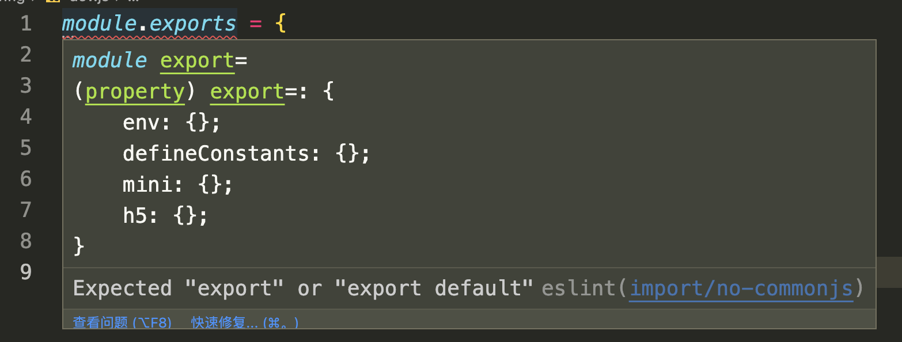
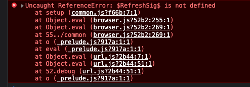
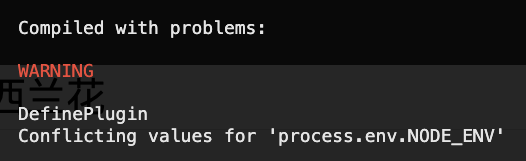

# 开始使用 Taro

全局安装 `@tarojs/cli` 之后，可在终端使用 taro 命令。

```sh
$ taro -v
👽 Taro v3.5.7
```

我使用的 taro 最新版本为 v3.5.7。推荐使用 v3.5 以上的版本，该版本升级了 Webpack5、react18、H5 多页面模式等，详情可以查看[博客](https://taro-docs.jd.com/blog/2022/07/26/Taro-3.5)。

使用 `taro init` 命令创建项目，根据提示选择适合自己的框架，我的选择是 React + Mobx + TypeScript。

```sh
$ taro init taro3-project
```

## 初始配置

项目生成之后，还要对一些细节做出修补。

首先通过提示安装的 mobx 版本较低，不支持 `makeAutoObservable`，因此我们要升级 mobx 依赖包如下：

```json
{
  "mobx": "^6.3.6",
  "mobx-react": "^7.2.1"
}
```

默认项目中没有配置路径别名。我们希望在导入文件时通过 `@` 符号来表示 `src` 目录，这样可以避免使用相对路径，最终效果如下：

```js
import util from '@/utils.js';
```

实现别名需要同时配置 Webpack 和 TypeScript。Webpack 配置在 `config/index.js` 文件中添加：

```js
const path = require("path");
// 别名配置
alias: {
  "@": path.resolve(__dirname, "..", "src"),
},
```

TypeScript 配置在 `tsconfig.json` 文件中添加：

```json
{
  "compilerOptions": {
    "baseUrl": ".",
    "paths": {
      "@/*": ["src/*"]
    }
  }
}
```

项目默认会安装 Eslint 检测代码，打开 config/ 下的配置文件时会报错：



错误信息是说 Eslint 要求使用 ESM 语法，而这里使用的是 CommonJS 语法，因此报错。所以在 `.eslintrc.js` 配置文件中会略这个验证：

```js
{
  rules: {
    ...
    "import/no-commonjs": "off",
  },
}
```

## H5 的坑

项目创建之后，使用以下命令运行 H5 项目：

```sh
$ yarn run build:h5 --watch
```

运行后在浏览器中打开页面，发现首页白屏，打开控制台报错如下：



经过查找，错误原因是：React 在 H5 Dev 编译模式时默认开启了[fast refresh](https://github.com/facebook/react/issues/16604#issuecomment-528663101) 功能。

解决方案：关闭 fast refresh。在 Babel 和 Webpack 中同时配置 `hot: false`，修改代码如下：

```js
// config/index.js
const config = {
  h5: {
    devServer: {
      hot: false,
    },
  },
};

// babel.config.js
presets: [
  [
    'taro',
    {
      framework: 'react',
      hot: false,
    },
  ],
];
```

这个问题解决之后，马上会遇到第二个问题。报错如下：



这个错误是因为在升级 Webpack5 之后，Webpack 会从配置文件的 mode 选项自动为 process.env.NODE_ENV 赋值。此时如果再通过 DefinePlugin 插件定义 NODE_ENV，就会造成定义冲突，于是报了上面的错。

解决方案：在 `config/dev.js` 和 `config/prod.js` 注释掉 NODE_ENV 的定义：

```js
module.exports = {
  env: {
    // NODE_ENV: '"production"',
  },
};
```

保存重新运行，项目终于能正常跑起来了。
