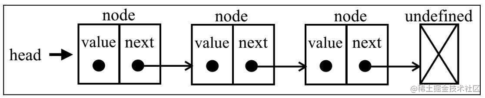

---
group:
  title: 链表篇
  path: /linked-list
  order: 4
order: 1
---

# 认识链表

大家好，我是杨成功。

前面几篇我们已经学过了数组，栈，队列与双端队列等数据结构，今天我们再遇见新朋友，一个动态的数据结构 —— 链表。

## 什么是链表

链表是一组动态的有序集合。这里的“动态”怎么理解呢？

首先回忆一下我们前面学过的数组，它是一个最基本的数据结构，在多数语言中大小固定。而链表则是在数组的基础上，允许随意添加和删除元素，相当于是一个“动态的”数组。

此时可能你会问：JavaScript 当中的数组也是动态的呀，也可以随意添加和删除元素呀。确实如此，不过 JavaScript 提供的原生方法虽然用起来方便，但是性能很低。

为什么？假设你要在数组的起点或中间插入元素，那么从这个位置开始，后面的所有元素都要后移一位，这个时候就不光是添加一个元素那么简单，本质上，是修改了后面的所有元素。

当数组特别大的时候，添加的位置越靠前，需要“挪动”的元素就越多。因而数组越大，操作数组元素的性能可能就越低。

但是链表就不一样了。链表虽然与数组功能一致，但是链表的元素在内存中独立放置，并不连续。每一个元素都由元素本身的值和下一个元素的引用组成，结构图如下：



看过这个图就更清晰了。当你需要在任意一个位置添加元素时，你只需新增一个元素，修改当前元素和上一个元素的引用即可，其他元素没有任何变化。因此不管你的链表长度如何，操作元素的性能都非常高。

但是链表一定比数组好吗？也不是。数组中我们可以通过索引访问任意位置的元素，而链表因为每个元素互相独立，想找到某个元素，必须从第一个元素（**表头**）开始一个一个向下查找，直到发现目标。

## 实现一个链表

上面我们介绍了链表，并且与数组做对比，简述了两者的差别和优劣势。理解了这些，下面我们就可以开始动手实现一个链表了。

首先看一下基本结构：

```js
class LinkedList {
  constructor() {
    this.count = 0;
    this.head = undefined;
  }
}
```

上述代码有两个属性：

- `count`：表示链表的长度，也就是元素的个数
- `head`：存储第一个元素（表头）的引用

前面说过，链表的元素包含自身的值和下一个元素的引用。我们在添加元素时，需要一个快捷的创建链表元素的方式，因此写一个 `Node` 类表示链表的元素：

```js
class Node {
  constructor(value) {
    this.value = value;
    this.next = undefined;
  }
}
```

有了这两个类，接下来就可以编写操作链表元素的方法了。

本篇只介绍常用的两个方法：

- `push`：向链表尾部添加一个元素
- `removeAt`：从链表某处移除一个元素

### push 实现

向链表尾部添加元素时，可能有两种情况：

- 链表为空，则添加第一个元素
- 链表不为空，在所有元素之后添加元素

```js
push(item) {
  let node = new Node(item)
  let current;
  if(!this.head) {
    this.head = node
  } else {
    current = this.head
    while(current.next) {
      current = current.next
    }
    current.next = node;
  }
  this.count++;
}
```

代码中首先判断存储表头引用的变量 `head` 是否赋值。如果未赋值则表示链表没有元素，此时将 head 赋值为新创建的元素即可。

如果变量 `head` 已赋值，则表示链表中已经有元素。我们通过 `head.next` 一层一层向下找，直到找到最后一个元素，即 next 属性为 undefined 的元素。

此时将链表最后一个元素的 next 属性赋值为新元素，就完成了尾部添加。

最后，不要忘了将长度 `count` 属性自增一。

### removeAt 实现

上面我们实现了添加元素的方法，这里再说如何从某处移除元素。

从某处删除元素，类似于删除数组中某个下标的元素。removeAt 方法要提供一个数值类型的参数，相当于数组的索引，表示要删除这个位置的元素。

基础结构如下：

```js
removeAt(index) {
  if(index >= 0 && index < this.count) {
    // 具体逻辑
  }
  return undefined;
}
```

在这个方法中，首先要限制参数 index 在 0 和 链表长度之间，然后再分两种情况去删除元素。

如果 `index` 等于 0，那么操作就比较简单，只需要将 `head` 属性的指向后移一位即可。

对应到代码是这样的：

```js
if (index === 0) {
  let current = this.head;
  this.head = current.next;
}
```

如果 `index` 大于 0，那么总体的思路分三步：

1. 找到 index 对应的元素 B
2. 找到 B 的上一个元素 A
3. 将 `A.next` 指向 `B.next`

当走到第三部时，相当于直接绕过了与 B 的链接，这就表示删除了元素 B。

对应到代码是这样的：

```js
if (index > 0) {
  let current = this.head;
  let previous;
  for (let i = 0; i < index; i++) {
    previous = current;
    current = current.next;
  }
}
```

综合两种情况，完整代码如下：

```js
removeAt(index) {
  if(index >= 0 && index < this.count) {
    let current = this.head;
    // 第一项
    if(index === 0) {
      this.head = current.next;
    } else {
      let previous;
      for(let i = 0; i < index; i++) {
        previous = current;
        current = current.next;
      }
      // 跳过 current，实现删除的目的
      previous.next = current.next
    }
    this.count--;
    return current.value
  }
  return undefined;
}
```

## 总结

本篇介绍了链表的概念，以及它与数组的区别，然后实现了 `push` 和 `removeAt` 两个方法。

链表的内容相对比较复杂，就本篇介绍的这两个方法，大家可以反复理解一下。下篇我们补充其他方法，并做最终的结果测试。

本文来源公众号：**程序员成功**。这是学习 JavaScript 数据结构与算法的第 9 篇，本系列会连续更新一个月。

欢迎关注公众号，点击“**加群**”一起加入我们的学习队伍～
