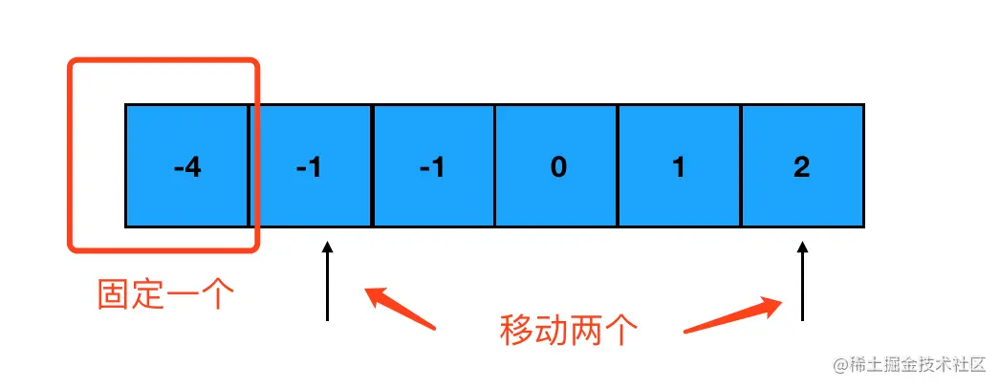

# 数组

列举数组的算法题。

## 1. 两数求和问题

真题描述：给定一个整数数组 nums 和一个目标值 target，请你在该数组中找出和为目标值的那两个整数，并返回他们的数组下标。

示例：给定 nums = [2, 7, 11, 15], target = 9。  
结果：因为 nums[0] + nums[1] = 2 + 7 = 9，所以返回 [0, 1]。

对于这个题目，大家首先会想到一个“简单粗暴”的方法，就是两层循环，然后将每层的值相加判断。但是这样的时间复杂度是 `O(n^2)`。

事实上，我们完全没有必要用两层循环，这样会让算法的时间成倍增加。我们可以用“**空间换取时间**”的思想，用一层循环解决这个问题，如下：

```js
const gethe = (nums, target) => {
  let diffs = {};
  for (let i = 0; i < nums.length; i++) {
    if (diffs[target - nums[i]]) {
      return [i, diffs[target - nums[i]]];
    }
    diffs[nums[i]] = i;
  }
  return null;
};
```

代码中申请一个 `diffs` 对象来存储循环过的值和下标，然后用求差的方式判断该对象中是否有符合条件的属性，如果有则返回各自的下标。

> 小提示：几乎所有的求和问题，都可以转化为求差问题解决。

## 2. 合并两个有序数组

真题描述：给定两个有序整数数组 nums1 和 nums2，请将 nums2 合并到 nums1 中，使 nums1 成为一个有序数组。

输入：  
nums1 = [1,2,3]  
nums2 = [2,5,6]  
输出：[1,2,2,3,5,6]

注意，要将数组 nums2 合并到 nums1 中，不是返回新数组，因此可以通过 `splice` 函数实现：

```js
nums1.splice(nums1.length, 0, ...nums2);
nums1.sort();
```

如果不使用快捷方法，只用遍历实现的话，应该怎么做呢？就要用到`双指针`法。

双指针法，就是定义两个变量，分别指向两个数组的最后一位索引。接着在循环中执行比较，当其中一个数组满足比较条件时，指针向前移动一位，直到某一个数组移动到第一位。

```js
const merge = function (nums1, nums2) {
  // 初始化两个指针的指向，初始化 nums1 尾部索引k
  let i = m - 1,
    j = n - 1,
    k = m + n - 1;
  // 当两个数组都没遍历完时，指针同步移动
  while (i >= 0 && j >= 0) {
    // 取较大的值，从末尾往前填补
    if (nums1[i] >= nums2[j]) {
      nums1[k] = nums1[i];
      i--;
      k--;
    } else {
      nums1[k] = nums2[j];
      j--;
      k--;
    }
  }

  // nums2 留下的情况，说明都是小值，放到最前面即可
  while (j >= 0) {
    nums1[k] = nums2[j];
    k--;
    j--;
  }
};
```

代码中的比较逻辑是，判断指针处哪个数组对应的值大，然后该指针向前移动，并将大的值添加到最后面，这样从后到前遍历一次，就会合并成一个有序的数组。

## 3. 三数求和问题

真题描述：给定一个包含 n 个整数的数组 nums，判断 nums 中是否存在三个元素 a，b，c ，使得 a + b + c = 0 ？请你找出所有满足条件且不重复的三元组。

> 注意：答案中不可以包含重复的三元组。

示例：给定数组 nums = [-1, 0, 1, 2, -1, -4]  
结果：[ [-1, 0, 1], [-1, -1, 2] ]

如果直接遍历的话，实现上面的需求要做三层循环。我们依然用空间换时间的思想，尽可能的减少遍历。

具体方法，仍然是使用指针来缩小搜索的范围。对于三数求和，我们使用 “固定一个，移动两个”的方式，如图：



每次移动指针，就计算一次固定值加上两个指针指向数字之和，是否等于 0。如果是，那我们就得到了一个目标组合；如果不是，则继续移动指针。

```js
const threeSum = (nums) => {
  num.sort();
  let res = [];
  let leng = nums.length;
  for (let i = 0; i < leng - 2; i++) {
    let j = i + 1;
    let k = leng - 1;
    while (j < k) {
      let diff = nums[i] + nums[j] + nums[k];
      if (diff == 0) {
        res.push([nums[i], nums[j], nums[k]]);
      } else if (diff > 0) {
        k--;
      } else {
        j++;
      }
    }
  }
};
```

代码中，将两个指针分别指向数组的前后位置，依次向中间移动，这种方式叫做“对撞指针”，可以避免多余的遍历。
