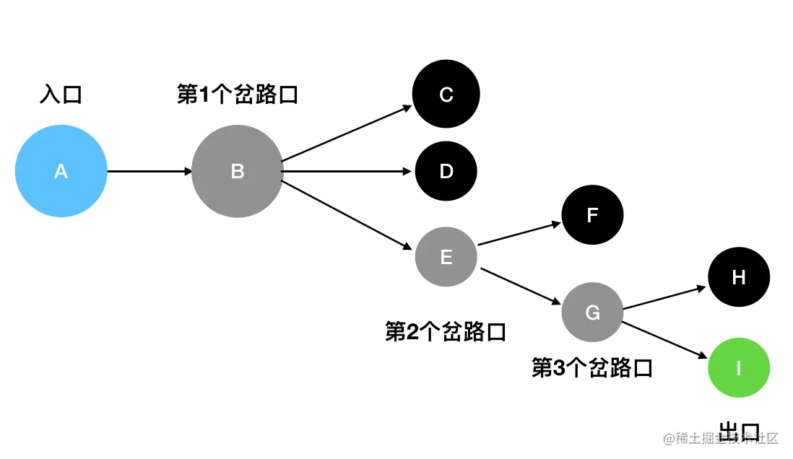

# 遍历

列举遍历的算法题。

## DFS 和 BFS

在遍历数据时，有两个关键的算法思想：深度优先搜索（DFS）和广度优先搜索（BFS）。

### 深度优先搜索

什么是深度优先呢？想象一下小的时候你在玩迷宫游戏，选择一个入口会一直向前走，中间遇到分叉也会选择一个继续向前，直到此路走不通，才会返回上一个分叉，选择另一个路口继续尝试。

这种一条道走到黑，“不撞南墙不回头”的法则，就是深度优先搜索。

如何实现深度优先搜索呢？我们看一张图：

在这张图中，蓝色的是入口，灰色的是岔路口，黑色的是死胡同，绿色的是出口。我们在查找路径的时候，首先选择任意一条路走，如果遇到死胡同再回退。脑中模拟一下这个过程，像不像入栈和出栈？

但是栈是线性结构，只能模拟一条路，而图中的是一个树形结构。因此 DFS 可以通过 `栈+递归` 的方式实现。

### 广度优先搜索

广度优先搜索，
