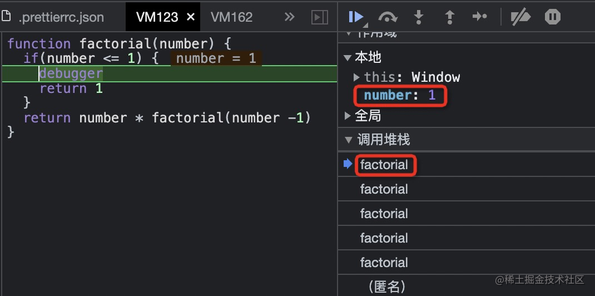
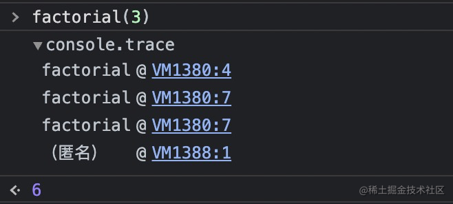
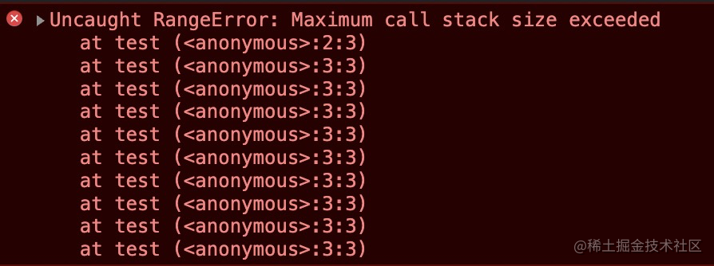

---
group:
  title: 递归篇
  path: /recursion
  order: 8
order: 1
---

# 认识递归

大家好，我是杨成功。

前面我们学习了很多线性的数据结构，包括数组，栈，队列，链表等，当需要操作其中的元素时，大多时候是通过遍历数据结构来实现的。

接下来我们会学习更复杂的数据结构 —— `树`和`图`。这两种数据结构的元素连接关系非常复杂，不是靠简单的遍历就能全部捕获到的。

因此，在学习这两个复杂数据结构之前，我们需要弄明白一个基本操作，这个操作就是**递归**。

本篇要讲的递归并不是一个数据结构，只是为了学好后面的复杂数据结构，需要我们必须补充的一个基本技能，因此单独拎出来介绍。

## 什么是递归

递归其实大家多多少少都使用过。比如前端 UI 组件库里的树形组件，就是一个典型的例子。通俗的说，递归的含义就是 `自己调用自己`。

在 JavaScript 当中，一个函数内部调用自身，我们就认为这是一个递归函数。

那为什么要用递归呢？递归能解决什么问题？

其实递归解决的是**动态层级**的问题。比如说你有一个多维数组，这个数组的维度是动态的，可能是两层，也可能是 10 层。这个时候你要处理每一层数据，肯定是没法在代码里写死要处理多少层的，这样不现实。

最常见的方式是在一个函数内只处理一层的逻辑，如果还有第二层，那么再调用函数自身，复用已有的处理逻辑。这样一层一层调用下去，直到最后一层。

递归一般有两种方式：

- 函数调用自身
- 两个函数互相调用

核心的代码逻辑如下：

```js
// 调用自身
function recursiveFun(someParam) {
  recursiveFun(someParam);
}

// 两个函数互相调用
function recursiveFun1(someParam) {
  recursiveFun2(someParam);
}
function recursiveFun2(someParam) {
  recursiveFun1(someParam);
}
```

假如现在调用 `recursiveFun` 函数，会发生什么？很明显，它会无限循环下去，也就是我们说的死循环，永远不会结束，一会你的浏览器就被干崩了。

因此，递归函数必须有 **终止条件**，以防止无限循环。

所以，合理的递归函数基本结构应该是这样的：

```js
function recursiveFun(someParam) {
  let is_finish = someParam[xx] == 'xxx';
  if (is_finish) {
    return true; // 终止循环
  }
  recursiveFun(someParam);
}
```

下面我们看一些著名的递归算法。

## 计算一个数的阶乘

数 `n` 的阶乘，定义为 `n!`，表示从 1 到 n 的整数的乘积。

比如 5 的阶乘表示为 5!，它的值为 `5 x 4 x 3 x 2 x 1 = 120`。

如果此时你想计算 100 的阶乘，那就不能像上面那样把每一个数相乘都写出来了，你需要将数设为 n，计算阶乘的表达式就如下：

```js
n * (n-1) * (n-2) * ... * 1
```

为了执行这个表达式，我们在一个函数内用循环来实现：

```js
function recursiveFun(number) {
  if (number <= 0) return undefined;
  let total = 1;
  for (let n = number; n > 1; n--) {
    total = total * n;
  }
  return total;
}
console.log(recursiveFun(5)); // 120
```

这是一个简单的倒序循环，依次递减算出最终值。当然我们会限制参数必须大于 0，否则阶乘无意义。

当然了除了使用循环，我们还可以用今天学到的 **递归** 来实现。

使用递归之前，我们先梳理一下思路。其实递归的原则就是将表达式拆分成最小的粒度，然后找到每个连续颗粒之间的关系，再用一个最简单的表达式表示出来。除此之外还要找到最后一个颗粒，也就是递归结束的条件是什么。

比如 **5 x 4 x 3 x 2 x 1** 这个阶乘的计算方法，很明显最小粒度就是每个值本身，他们的关系是后一个值永远比前一个值小 1。假设第一个元素为 `n`，第二个就是 `n-1`，最后结束的条件是 `n = 1`。

我们现在定义一个 **factorial** 函数，以最小颗粒 n 为参数，逻辑如下：

- factorial(5) = 5 \* factorial(4)
- factorial(4) = 4 \* factorial(3)
- factorial(n) = n \* factorial(n-1) // n>=1

根据这个步骤，实现代码如下：

```js
function factorial(number) {
  if (number <= 1) {
    return 1;
  }
  return number * factorial(number - 1);
}
console.log(factorial(3)); // 6
```

看结果，最终是 6，是执行 `3 * 2 * 1` 计算出来的值。

## 看清递归的执行顺序

递归函数会不断调用自己，直到触发终止条件才会停止。有时候可能调用链比较长，导致调试困难。那有没有办法能够看清楚调用的顺序呢？

有的，下面我介绍两个方法。

**方法一**：在终止条件的代码块中加一个 `debugger`，上述递归函数中修改的部分是：

```js
if (number <= 1) {
  debugger;
  return 1;
}
```

然后打开控制台，执行代码会出发断电，然后在浏览器的右侧这个部分你就能看到调用顺序了：



图中调用堆栈的部分就是每次调用的记录，一共 5 次，可以点击切换查看每次调用时函数内部的参数值。

**方法二**：将方法一的 debugger 换成 `console.trace()`

然后调用 **factorial(3)**，看控制台打印情况：



这里能直观的看到调用了几次，图中蓝色部分可点击，点击后会看到具体的方法和调用位置，对于调试代码非常方便。

最后我们思考一下：如果递归没有终止条件，会一直调用下去吗？

其实不会的，浏览器在升级中已经对这种情况做了处理。我们试一下无限递归调用：

```js
var count = 1;
function test() {
  count++;
  test();
}
test();
```

控制台报错如下：



这个意思就是超出了最大调用次数，我们看它实际调用了多少次：

```js
console.log(count); // 10989
```

看来最多调用一万多次，我估计这个和电脑性能有关，大家可以测试自己的。

## 总结

本篇介绍了递归的概念和如何使用递归，然后用递归实现了数的阶乘。最后我们还介绍了如何在浏览器更好的调试递归函数，相信你看完这篇对递归的理解更深了。

下一篇，我们继续用递归，实现著名的斐波那契数列。
