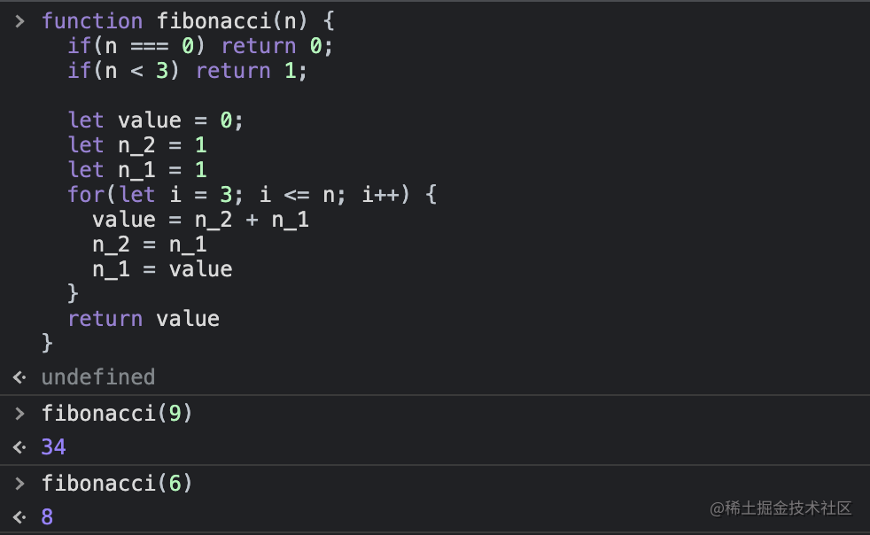
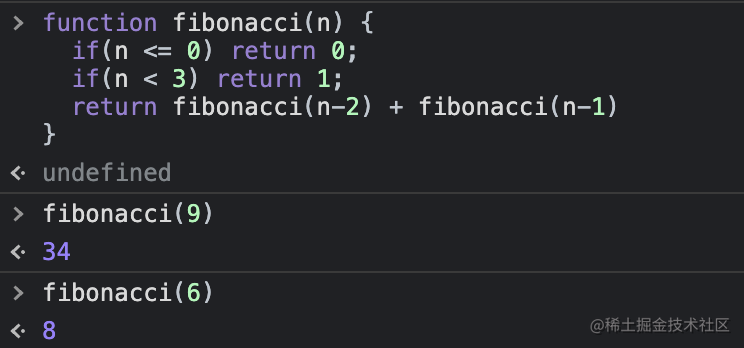
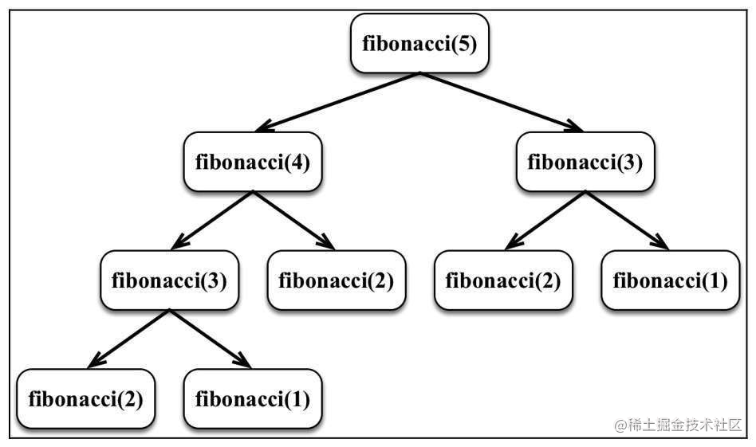
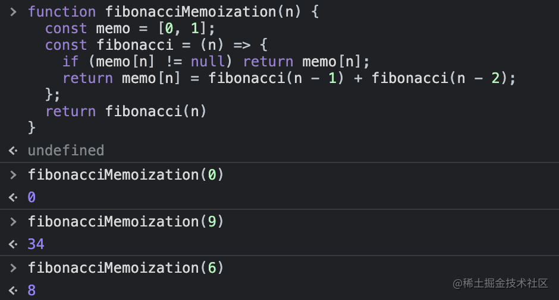

# 斐波那契数列

大家好，我是杨成功。

上一篇介绍了递归，以及如何用递归实现数的阶乘。其实递归大家平时都会碰到，只不过有时候写一个递归函数要改好多次才能走通，缺乏那种能直接写好的直觉。其实还是关键思路没有掌握透。

本篇我们继续用递归解决问题，不过实现对象是大名鼎鼎的**斐波那契数列**。可能很多人听过这个名字，但不知道它是干啥的。

其实斐波那契数列就是一组数值，每个数值按照一定的规则排列递增。这与上一篇介绍的**阶乘**有相似之处，数值之间的关系可以用某种最小粒度的表达式写出来。

下面我们进入正题，看如何用递归实现斐波那契数列。

## 斐波那契数列

斐波那契数列是一个由 `0、1、1、2、3、5、8、13、21、34` 等数组成的序列。

序列前两位固定值是 `0, 1`，从第三位开始，每个数值都是前两位数相加之和，以此不断累加。

比如数值 3 由 1+2 得到，数值 5 由 2+3 得到。根据这个规则可以推断，在 `n` 位置的斐波那契数，是 `n-2` 位置的数值加上 `n-1` 位置的数值。

理解到这，我们先用循环实现斐波那契数列：

```js
function fibonacci(n) {
  if (n === 0) return 0;
  if (n <= 2) return 1;

  let value = 0;
  let n_2 = 1;
  let n_1 = 1;
  for (let i = 3; i <= n; i++) {
    value = n_2 + n_1;
    n_2 = n_1;
    n_1 = value;
  }
  return value;
}
```

上述代码中，`n_2` 表示 `n-2`  位置的值，`n_1` 表示 `n-1`  位置的值。我们从位置 3 处开始，在循环体中计算 `n_2 + n_1` 的值，最后赋予 value，并且将 n_2 和 n_1 的值后移一位，以供下一次循环使用。

这样我们通过循环 + 三个变量，实现了斐波那契数列。

试一下使用效果，结果如下：



第 n 位（n 从零开始）表示的值符合预期，说明该函数可用。

## 递归实现斐波那契数列

上面介绍了循环实现斐波那契数列的方法，我们再看递归如何实现。

上一篇我们说过，在用递归实现某个功能之前，先梳理思路，找到两个东西：

1. 最小粒度的表达式
2. 终止条件

前面我们推断出，在 `n` 位置的斐波那契数，是 `n-2` 位置的数值加上 `n-1` 位置的数值，所以表达式就是：

```js
f(n) = f(n-2) + f(n-1)
```

表达式如上，终止条件呢就是 `n <= 2` 时返回固定值，因为数列前三个值是固定的。

所以最终的递归函数如下：

```js
function fibonacci(n) {
  if (n <= 0) return 0;
  if (n <= 2) return 1;
  return fibonacci(n - 2) + fibonacci(n - 1);
}
```

函数简单吧，看测试结果：



依然满足条件，说明该函数可用。我们用图来看一下这个函数的递归流程：



## 记忆化斐波那契数

上面我们分别用循环和递归实现了斐波那契数列，其实还有第三种方式，就是**记忆化**。

记忆化的含义就是将前面计算的值缓存下来，根据这些已有值计算出新值。新值再缓存下来，当后面需要这些一层层缓存下来的值时，可以直接拿来使用。

那为什么要使用记忆化呢？再看上面那张递归流程图。

仔细看，你会发现图中 **fibonacci(2)** 调用了 3 次，**fibonacci(3)** 调用了 2 次，这样重复执行函数肯定会降低性能。因此我们可以通过缓存值，也就是记忆化来优化逻辑。

直接上使用记忆化的 fibonacci 函数：

```js
function fibonacciMemoization(n) {
  const memo = [0, 1];
  const fibonacci = (n) => {
    if (memo[n] != null) return memo[n];
    return (memo[n] = fibonacci(n - 1) + fibonacci(n - 2));
  };
  return fibonacci(n);
}
```

这个函数使用我们非常熟悉的闭包，将计算过的值缓存在了 `memo` 这个数组中。这样的话只要计算过的值都会被复用，减少了多余的函数调用。

我们测试下这个函数：



结果也是没问题的，但要比纯递归性能好了许多。

## 总结

本篇介绍了非常著名的斐波那契数列，然后我们用循环和递归实现了这个数列。相信看到这里，你对递归和斐波那契数列有一个更明了的认识了。

下一篇，我们看几道递归的经典题目，加油吧！
