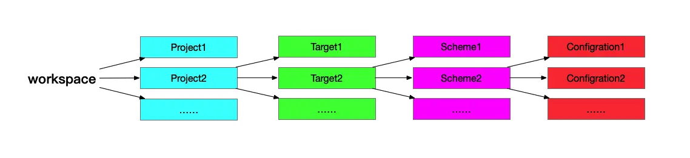

# IOS 基本介绍

IOS 应用程序使用 Xcode 进行编译，打包的时候会接触到 **workspace、project、target、scheme** 四个概念，下面我们来详细介绍。

## Project

`Project` 是基本工程，包含了所有的代码文件。Project 可以单独存在，也可以被包含在 Workspace 中。

一个 Project 可以包含一个或者多个 Target。Project 中的编译设置 `Build Setting` 作用于所有的 Target，每一个 Target 可以单独设置自己的编译配置。

## Target

Target 是编译的目标，会继承 Project 的编译设置，也有自己的编译设置。Target 的编译设置主要是 `Build Setting` 与 `Build Phases` 两部分。

一个 Target 经过编译之后就只会生成一个对应的 Product。

## Worksapce

`Worksapce` 顾名思义是工作空间，是 Xcode 的一种文件，可管理 Project 和其他文件。

## Scheme

`Scheme` 可看成编译的配置文件，我们可以指定以下部分的配置选项：

- build（编译）
- Run（运行）
- Test（测试）
- Profile（性能分析）
- analyze（语法分析）
- archive（打包）

Scheme 是针对 Target 的，一个 Target 可以设置多个不同的 Scheme。XCode 默认只有一个与 Project 同名的 Scheme。

Scheme 默认配置选项（Configuration）有 `Debug` 与 `Release` 两种，
