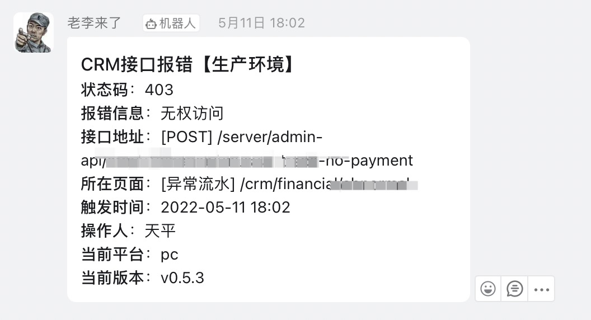
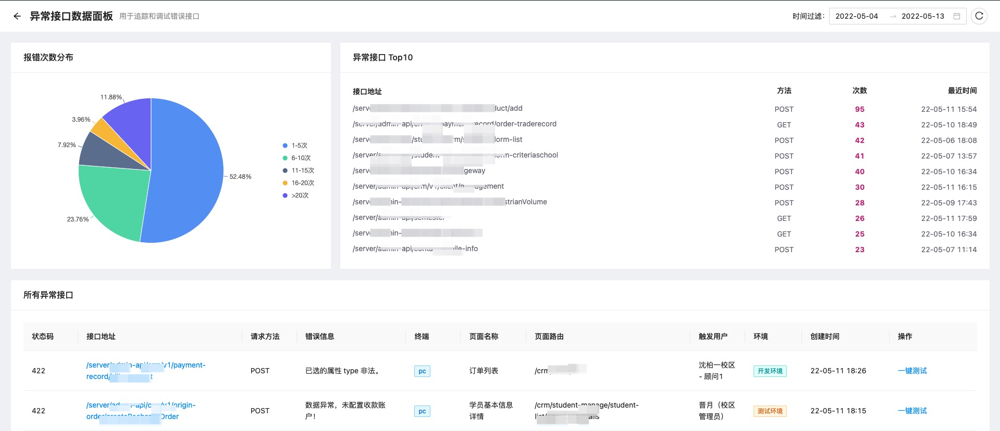

# 为什么前端应该有监控系统

大家好，我是杨成功。

提到监控系统，大部分同学首先想到的是后端监控。很明显，比如检测服务器性能，数据库性能，API 的访问流量，以及各种服务的运行情况等等，都与后端息息相关。而前端更多承担的是 UI 展现的角色，主要关注页面怎么排版设计，好像没什么需要监测的地方，因此一直以来都没有涉及到监控的概念。

于是呢大家就一致认为：**只要后端稳定可控，应用就是稳定可控的**，可实际情况真的是这样吗？

近年来，前端发展日益迅猛，得益于 JavaScript 的持续进化和浏览器功能的不断增强，前端能做到的事情越来越多，相应的前端应用的复杂度也越来越高。以前我们压根不会遇到的问题，现在蹭蹭蹭的一股脑都冒出来了。

举个例子，小明是个前端程序员，有一天用户反馈某页面某按钮点了没有反应。小明立刻找到那个按钮，轻轻一点，咦？正常的呀。然后小明又用了几个不同的账号测试，依然是正常的。这下可把小明难倒了。

怎么办？我相信全天下的前端程序员们遇到奇怪问题的反应是一样的。小明这样告诉用户：**可能是浏览器缓存问题，不行强制刷新一下，或者退出登录试试？** 用户按照小明的建议操作一番，果然奏效！于是给小明发来了一连串的“感谢 🙏”。小明尴尬一笑，连忙回复“小意思”。

过了两天，又有一个用户反馈了同样的问题。小明又祭出了上面的万能解决大法，依然奏效。可是问题真的解决了吗？没有啊！然而小明尝试过很多遍都无法复现异常，可能原因有很多，比如：

1. 数据问题，可能取不到某个属性
2. 前端问题，JS 代码执行异常
3. 接口问题，可能接口无响应，或没有返回预期的值

然而正常情况下是没有问题的，小明多次测试也都正常，一定是在某种特定场景下才会出现这个问题，但是我们无法判断，捕捉不到。

像这类 Bug 潜伏在我们的系统中，仿佛地雷一样，指不定什么时候就会爆。最尴尬的是即便它爆了我们也很难发现，这就导致我们的“排雷行动”困难重重。

某个阳光明媚的下午，小明坐在马桶上思考人生。突然脑海中一道灵光闪过，小明想到：“如果在用户触发异常的那一刻，系统能自动获取到异常的数据并保存起来，然后在后台的某个地方能看到这些数据，我不就可以立刻找到错误原因了吗？”

小明一拍大腿，对呀！我怎么没有早点想到呢？这样的话，只要发生异常我们就能自动捕获到异常数据，如果再遇到线上报错，我们不需要用户反馈，自己就可以发现，而且能马上定位错误原因，这不是一举两得？

我相信许多前端前辈们也曾经被上述的问题所困扰，然后也像小明一样，慢慢的有了这个思路：“**将报错时的异常数据存下来供后续排查**”。在这个思路不断实践的过程中，逐渐演变成了今天的前端监控。

当然了，今天的前端监控并不仅仅是监控异常数据，任何有利于产品分析的数据都可以加入监控。所以我认为前端监控，就是指**采集用户使用系统过程中产生的关键数据，存储到数据库，后续可以查找和分析**，这样的整套实现就被称为前端监控系统。

## 前端监控具体能解决什么问题？

上面用一个例子推导出前端监控出现的背景，粗略的说了下它如何追踪线上报错问题，大家应该初步了解了前端监控的意义。现在我们把目光聚焦在**项目**上，再详细探究一下它具体能解决哪些问题。

### 异常报错问题

首先就是异常报错的问题。就如例子中的场景一样，线上发生异常，有时候我们难以复现，甚至如果没有用户反馈，我们都不知道有这个问题，这样就给用户传递了一种我们的产品很不稳定的感觉。因此前端监控是线上产品稳定和异常及时反馈的非常关键的保障。

当然了，除了前端的异常，我们同样可以捕获 **接口异常**。有的时候前端程序员们自嘲自己是“背锅侠”，产品，测试，用户，遇到问题首先找前端，不管是不是前端的问题，前端先顶，再花时间定位错误。有的时候领导脾气不好，上来先劈头盖脸一顿骂，卑微前端也不敢说话，因为啥问题得排查后才清楚，结果排查完后是接口的问题，白挨了一顿骂，心里就非常不爽。

但是如果有了前端监控，我们就能马上拿到异常发生时的错误信息，页面，地址，参数等，什么问题一查便知。下一次遇到线上事故，前端就可以从容不迫客观公正的说这是哪一方的问题。如果遇到甩锅行为，前端也能勇敢说不，毕竟我证据在手，岂容你说吼就吼？

### 性能检测问题

追踪异常是前端监控最实用的地方，但不光如此，**性能监控** 也是非常关键的部分。

当下的前端工程体量很大，如果代码质量不高，或者项目架构设计不合理，很容易遇到性能问题。性能问题比如首屏加载时间，页面是否卡顿，白屏，资源重复请求等，可以通过数据采集，比如计算渲染时间，请求接口数量，请求资源总量等，对某个页面进行监控，及时发现性能问题。

那么除了可以“解决问题”，前端监控还有哪些价值？

### 运营反馈工具

其实前端监控除了可以帮助程序员不断优化和完善应用，对产品和运营同学有同样不可或缺的作用。具体来说就是通过“**埋点监控**”来收集用户的行为数据，则可以对线上产品的使用情况作出统计分析，比如整体的 PV/UV，某个功能的访问量，访问时段，点击率等等数据。这些数据可以帮助产品和运营了解实际情况，进而改进产品功能。

这些行为数据的收集，可以非常精准的描绘出某个功能或者某个人的实际使用情况。当然采集的数据量也要比异常数据大的多。相比来说，异常监控是只有发生异常才会收集数据，而行为数据则是，只要用户使用我们的产品，与产品发生交互，理论上这些数据都要收集起来。

当然监控是多方面的，收集哪些数据视情况而定。总之你想了解产品的任何情况，都可以通过**设计采集规则**然后收集数据来实现，这方面是非常灵活的，并不仅仅限于大家熟知的那几个指标。

## 为什么要选择自研？

前端监控发展到现在，必然会有成熟的第三方平台。目前国内最常用的有三个：

- sentry
- webfunny
- fundebug

首先 sentry 和 fundebug 这两个平台是付费的，而且你的数据越多费用越高，相当于是数据托管平台。webfunny 虽然可以私有化部署，但是它的功能是固定的，没法改代码，这就是它的缺点：不够灵活，无法定制功能。

所以目前虽然市面上已经有成熟的监控系统，但依然有很多团队选择自研。一是数据可以保存在自己的服务器上，不用另外花钱；二是灵活性强，可以自定义功能，比如你可以在触发异常时，接入自己的钉钉或企业微信消息推送，这就需要你的监控系统灵活性很高。

还有我们上面说的，**自定义采集规则**。我认为这个是最重要的原因。不同规则采集到的数据不一样，因此第三方标准的采集规则可能并不符合你公司的需求。比如有的公司需要获取设备标识作为唯一 ID，有的公司却需要用户标识。这是由业务决定的，每个公司都不一样。

我司前端组就是自研前端监控平台。优势就是可以自定义自己的采集规则，设计自己的数据库存储字段，数据都保存在自己的平台，灵活性和可靠性都非常高，能满足自己的多样性需求。

## 自研前端监控的技术栈

先上结论，我司的前端监控是前端组自己搞的，所以技术栈是 `React + Node.js + MongoDB`。

这是一个比较常规的技术方案，前端自己搞嘛，所以技术栈都以 JS 为主。同时这也是前端比较能琢磨明白的东西，算是一个标准方案吧。

其中，Node.js 部分我们使用 `express` 框架写接口，接口总体分两大类，就是 `写入` 和 `查询统计`，作用呢就是前端采集到数据之后，要通过调用接口存储。之后在监控面版上，也要通过接口将数据查询展现出来。

接口的背后就是 `MongoDB` 数据库，作用就是存储我们采集到的数据。为什么选择 MongoDB 呢？最主要的原因就是它的写入性能非常高，写入速度非常快。上面我们说，监控系统在采集行为数据的时候，写入非常频繁，那么对写入性能的要求就非常高，反观查询反而要求不那么高。

这里也有比较难啃的点，就是采集到大量的数据之后，我们需要各个维度的统计分析。比如：

- 某个时间段用户的访问次数和访问时长排行
- 某个时间段页面的访问频率和停留时间排行
- 某个时间段接口报错的次数以及占比统计

这些比较复杂的查询统计，主要用到 MongoDB 的聚合查询。前端写个基本的分组统计还行，这类复杂查询我们就捉襟见肘了。怎么办呢？我们用很长一段时间啃掉了 MongoDB 聚合查询的所有文档，按照需求一个一个找函数，看哪个能实现，几乎把所有聚合函数都翻了一遍。

接口做完，最后用 React 实现一个管理后台，将数据以图表，表格的形式展示出来，就可以实时看到线上产品的使用情况了。

当然还有一步，就是写一个对接钉钉或企业微信的通知接口，在触发异常的时候发起通知，让我们能及时知道异常情况。我们的通知是这样：

这个信息就能比较全面的看出来是哪里出了问题，如果看更详细的错误再去异常面板去找：

总之首先对接口异常全面监控，确认数据没问题之后我们再前端去排查，效率提高了，锅也少背了，这不是两全其美吗？

最后我们自研的这个小系统在产品上线后发挥了很大的作用，受到了老板的表扬，这样让我们受到了鼓舞，继续完善它～

## 更多资源

本文来源公众号 [程序员成功](https://www.ruims.top/static/wxpub.png)。作者杨成功，专注于前端工程与架构的分享，关注我查看更多硬核知识。

本文的任何问题和建议，都欢迎与我沟通，感谢阅读 🙏
