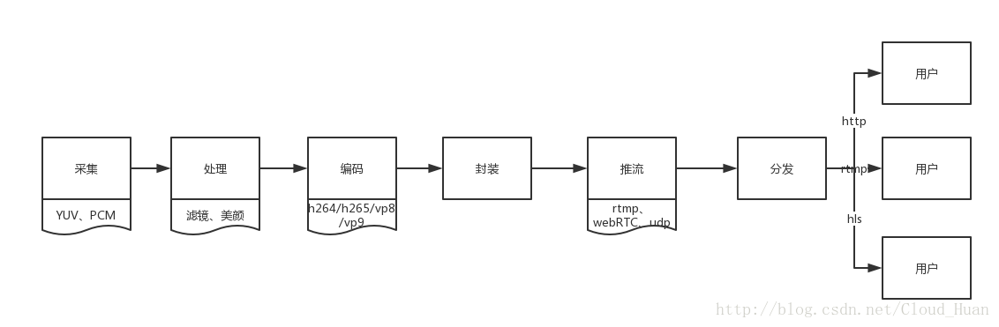

# 直播流程解析

在调试直播应用时，遇到卡顿情况却无从下手，原因是我们对直播流程等不熟悉，本篇来总结一下从直播发起到被其他人观看，需要经历哪些环节。

一个完整的直播过程包括但不限于以下环节：采集、处理、编码、封装、推流、传输、转码、分发、解码、播放等。下面我们分布介绍。

## 1. 采集

采集是从系统的采集设备中获取原始视频数据，将其输出到下一个环节。视频的采集涉及两方面数据的采集：音频采集和图像采集，它们分别对应两种完全不同的输入源和数据格式。

**音频采集**：通过设备将环境中的模拟信号采集成 `PCM` 编码的原始数据，然后将数据`编码压缩`成 MP3 格式分发出去。

常见的音频压缩格式有：MP3，AAC，HE-AAC，Opus，FLAC，Vorbis (Ogg)，Speex 和 AMR 等。

**图像采集**：由摄像机或其他设备拍摄成 `YUV` 编码的原始数据，然后`编码压缩`成 H.264 格式数据进行分发出去。

常见的视频封装格式有：MP4、FLV、3GP、AVI、MKV、WMV、MPG、VOB、SWF、MOV、RMVB 和 WebM 等。

## 2. 处理

在采集音视频之后，我们获得了原始数据。为了增强一些额外的效果，我们通常在压缩之前对这些数据做特定的处理，比如加上时间和水印，或者现在直播流行的美颜和变声，都是在这个阶段处理的。

视频处理包括：美颜、水印、滤镜、自定义。

音频处理包括：混音、降噪、声音特效、自定义。

## 3. 编码

对于流媒体传输，编码非常重要。其编码性能，编码速度、编码压缩比直接影响整个流媒体传输的用户体验和传输成本。

常见的视频编码器：

- H.264/AVC
- H.265/HEVC
- VP8
- VP9
- FFmpeg

常见的音频编码器：Mp3, AAC, Opus 等。

编码分为硬件编码（硬编）和软件编码（软编）。硬编靠 GPU，性能更好；软编靠 CPU，兼容性更好。

## 4. 封装

音频和视频编码之后，它们还是两个独立的存在。现在我们要将它们封装在一起，组成一条媒体流，可用于之后的传输和播放。

下面是几种常见的封装格式：

- AVI 格式(后缀为 .avi)
- QuickTime File Format 格式(后缀为 .mov)
- MPEG 格式(文件后缀可以是 .mpg .mpeg .mpe .dat .vob .asf .3gp .mp4 等)
- Real Video 格式(后缀为 .rm .rmvb)
- Flash Video 格式(后缀为 .flv)
- MPEG2-TS 格式 (后缀为 .ts)

目前，我们在流媒体传输，尤其是直播中主要采用的就是 FLV 和 MPEG2-TS 格式，分别用于 RTMP/HTTP-FLV 和 HLS 协议。

## 5. 推流

推流是指将封装后的媒体流传输到服务器的过程。一般推流靠推流工具或 App 来实现，这些工具内部集成了从采集到推流的整个环节。

推送协议主要有三种：

- RTSP（Real Time Streamin）：实时流传送协议。
- RTMP（Real Time Messaging）：实时消息传送协议。
- HLS（HTTP Live Streaming）：苹果公司的流媒体传输协议。

RTMP 是目前主流的流媒体传输协议，广泛用于直播领域，市面上绝大多数的直播产品都采用了这个协议。

## 6. 拉流

推送出去的流媒体首先到达流媒体服务器，然后在直播播流端通过拉流播放，这个环节主要考验带宽和网速。

## 7. 转码

直播播流端的码率是根据推流端决定的，即播流端的码率与推流端的码率一致。但是遇到以下场景会造成直播效果不佳：

- 推流端码率较高、播流端带宽有限，会导致播放出现卡顿。
- 推流端码率较低、播流端对直播效率要求较高，会导致播放效果较差。

一般情况下，前端播放器插件可以设置码率切换，这就需要同一路推流可以同时提供多种码率的播流地址。

因此，流媒体服务器提供了`实时转码`功能，可对同一路推流地址生成多路不同码率的播流地址。

## 8. 解码

拉流获取的是编码后的媒体流，在播放器需要将其解码。

- 编码器(Encoder)：压缩信号的设备或程序。
- 解码器(Decoder)：解压缩信号的设备或程序。
- 编解码器(Codec)：编解码器对。

## 9. 播放

拉流获取的流数据实时解码之后，扔给播放器播放，一般支持拉流协议都可播放。

- 电脑端：VLC 等。
- 手机端：Vitamio 以及 ijkplayer 等。
