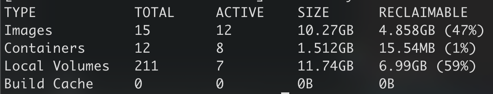
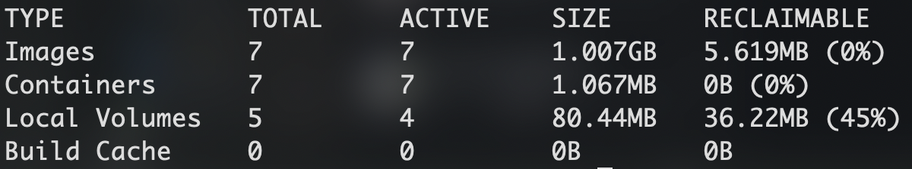

# Docker 磁盘清理

Docker 长时间运行后，会生成大量的数据文件，默认情况下这些数据都会存在 Linux 系统盘下，直接导致磁盘占满（我的产生了 50G 数据），本篇介绍如何做 Docker 磁盘清理。

涉及到 Docker 磁盘占用情况，主要用到 `docker system` 命令。

## 查看占用

查看当前 Docker 使用的磁盘情况，使用以下命令：

```sh
$ docker system df
```



命令结果如图所示，分别显示 Docker 中的镜像（Images）、容器（Containers）、数据卷（Volumes）、缓存（Cache）各自占用的磁盘空间。

其中数据卷（Volumes）最容易产生大量数据，这里的数据是在运行容器时通过 `-v` 参数指定数据卷时产生的。当容器停止或销毁后数据也不会清除，因此要定时清除数据卷中无效的数据。

查看镜像、容器、数据卷列表使用以下命令：

```sh
$ docker images # 镜像列表
$ docker ps -a # 容器列表
$ docker volume ls # 数据卷列表
```

使用上述命令检查到无用的镜像、容器时，可以直接删除。

## 清理磁盘

Docker 提供了快捷的清理磁盘的命令，如下：

```sh
$ docker system prune
```

该命令会自动清除 dangling 镜像（没有标签且不被使用的无效镜像）、已经停止的容器、没有被使用的网络。

如果你想彻底的清除，可以加 `-a` 参数，会清楚所有未使用的镜像，以及清除所有缓存。

```sh
$ docker system prune -a
```

然而上面命令依然不能清除 Volumes 中的无效数据。必须使用以下命令，列出所有无效数据并删除：

```sh
$ docker volume rm $(docker volume ls -qf dangling=true)
```

执行此命令后，大量的无效数据卷就被彻底删除了。再使用 `docker system df` 查看磁盘占用，如下：



## 系统盘占用问题

在 Linux 系统中，Docker 的默认目录是 `/var/lib/docker`，该目录挂在系统盘下。当 Docker 产生大量数据后，就会把系统盘吃满，导致系统运行卡顿甚至崩溃。

使用 `df -h` 命令查看磁盘占用情况，也许会看到系统盘空间被 Docker 大量占用。

解决方案之一是上面介绍的按时清理磁盘，根本方案是将 Docker 目录从系统盘改到数据磁盘。

假设 `/data` 目录是我们的数据磁盘，新建 `/data/docker/lib` 目录表示要迁移的目录，将 `/var/lib/docker` 下的所有数据都拷贝到 `/data/docker/lib` 下，分四步实现：

1. 停止 Docker 服务

```sh
$ systemctl stop docker
```

2. 迁移数据

```sh
$ rsync -r -avz /var/lib/docker/* /data/docker/lib/
```

3. 修改 Docker 配置

数据迁移后，修改 Docker 的默认目录地址，新建如下文件：

```sh
# 不存在就创建
$ sudo vi /etc/systemd/system/docker.service.d/devicemapper.conf
```

然后在 `devicemapper.conf` 中写入如下内容：

```
[Service]
ExecStart=
ExecStart=/usr/bin/dockerd  --graph=/data/docker/lib
```

4. 重启 Docker 服务

```sh
$ systemctl daemon-reload
$ systemctl restart docker
$ systemctl enable docker
```

上述 4 步执行完成后，用命令 `docker info` 查看配置信息，可以看到修改已生效。

确认运行无误，删除 `/var/lib/docker` 文件夹，系统盘的空间就被释放了。
